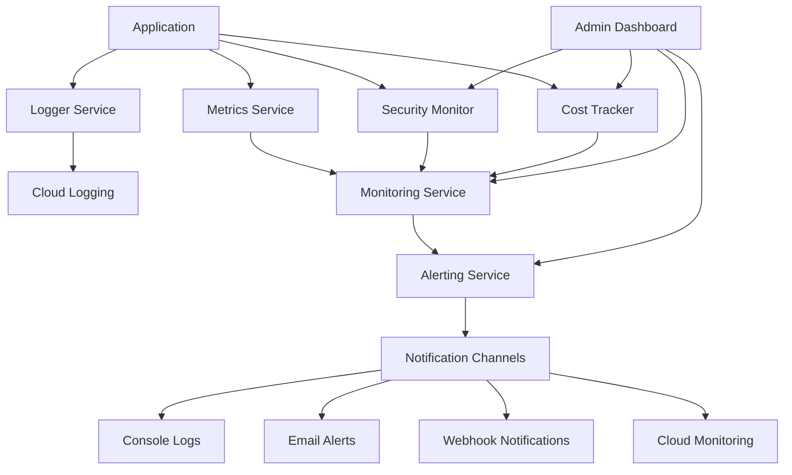

# Production Monitoring and Alerting Configuration Guide

## Overview

This guide provides comprehensive instructions for configuring, managing, and optimizing the monitoring and alerting systems for AdCraft AI in production. The monitoring stack includes structured logging, performance metrics, security monitoring, cost tracking, and intelligent alerting with multiple notification channels.

## Architecture Overview

### Monitoring Stack Components



### Service Integration

- **Logger Service**: Structured logging with correlation IDs
- **Metrics Service**: Performance and system metrics collection
- **Monitoring Service**: Health checks and system orchestration
- **Alerting Service**: Rule-based intelligent alerting
- **Security Monitor**: Security event tracking and threat detection
- **Cost Tracker**: Budget monitoring and cost optimization
- **Admin Dashboard**: Real-time monitoring interface

---

## Logger Service Configuration

### Production Logger Setup

#### Environment Variables

```bash
# Production logging configuration
LOG_LEVEL=info                    # info, warn, error, critical
LOG_FORMAT=json                   # json for structured logging
LOG_RETENTION_DAYS=90            # Log retention period
CORRELATION_ID_ENABLED=true      # Enable request correlation
CLOUD_LOGGING_ENABLED=true       # Enable Google Cloud Logging
```

#### Logger Service Configuration

```typescript
// Production logger configuration
const loggerConfig = {
  level: "info",
  format: "json",
  enableCloudLogging: true,
  enableConsoleLogging: false,
  enableFileLogging: false,
  correlationIdEnabled: true,
  performanceTrackingEnabled: true,
  retentionDays: 90,
  maxLogSize: "100MB",
  rotationInterval: "daily",
};
```

#### Cloud Logging Integration

```bash
# Enable Cloud Logging API
gcloud services enable logging.googleapis.com

# Create custom log sink for application logs
gcloud logging sinks create adcraft-app-logs \
  bigquery.googleapis.com/projects/$GOOGLE_CLOUD_PROJECT/datasets/adcraft_logs \
  --log-filter='resource.type="cloud_run_revision" AND resource.labels.service_name="adcraft-service"'

# Set up log-based metrics
gcloud logging metrics create error_rate \
  --description="Application error rate" \
  --log-filter='resource.type="cloud_run_revision" AND severity>=ERROR' \
  --value-extractor='EXTRACT(jsonPayload.duration)'
```

#### Log Monitoring Queries

```sql
-- High error rate detection
SELECT
  timestamp,
  severity,
  jsonPayload.message,
  jsonPayload.correlationId,
  jsonPayload.endpoint
FROM
  `$GOOGLE_CLOUD_PROJECT.adcraft_logs.cloud_run_logs`
WHERE
  severity >= "ERROR"
  AND timestamp >= TIMESTAMP_SUB(CURRENT_TIMESTAMP(), INTERVAL 1 HOUR)
ORDER BY timestamp DESC
LIMIT 100;

-- Performance analysis
SELECT
  jsonPayload.endpoint,
  AVG(CAST(jsonPayload.duration AS INT64)) as avg_duration,
  COUNT(*) as request_count,
  COUNTIF(severity >= "ERROR") as error_count
FROM
  `$GOOGLE_CLOUD_PROJECT.adcraft_logs.cloud_run_logs`
WHERE
  timestamp >= TIMESTAMP_SUB(CURRENT_TIMESTAMP(), INTERVAL 24 HOUR)
  AND jsonPayload.duration IS NOT NULL
GROUP BY jsonPayload.endpoint
ORDER BY avg_duration DESC;
```

---

## Metrics Service Configuration

### Production Metrics Setup

#### Environment Variables

```bash
# Metrics configuration
METRICS_ENABLED=true
METRICS_RETENTION_DAYS=30
SYSTEM_MONITORING_ENABLED=true
CUSTOM_METRICS_ENABLED=true
METRICS_COLLECTION_INTERVAL=30000    # 30 seconds
```

#### Key Metrics Collected

##### Performance Metrics

```typescript
interface PerformanceMetrics {
  // API Performance
  apiResponseTime: number; // Average response time per endpoint
  apiSuccessRate: number; // Success rate percentage
  apiErrorRate: number; // Error rate percentage
  apiThroughput: number; // Requests per minute

  // System Performance
  cpuUsage: number; // CPU utilization percentage
  memoryUsage: number; // Memory usage in bytes
  memoryPercent: number; // Memory utilization percentage
  diskUsage: number; // Disk usage in bytes

  // Application Performance
  videoGenerationTime: number; // Average video generation time
  videoSuccessRate: number; // Video generation success rate
  concurrentGenerations: number; // Active video generations

  // Database Performance
  firestoreReadLatency: number; // Firestore read response time
  firestoreWriteLatency: number; // Firestore write response time
  firestoreErrorRate: number; // Firestore operation error rate
}
```

##### Business Metrics

```typescript
interface BusinessMetrics {
  // Usage Metrics
  totalUsers: number; // Total unique users
  dailyActiveUsers: number; // Daily active users
  videosGenerated: number; // Total videos generated
  chatSessions: number; // Total chat sessions

  // Performance Metrics
  userSatisfactionScore: number; // User satisfaction (1-5)
  averageSessionDuration: number; // Average user session time
  featureUsageRate: number; // Feature adoption rate

  // Cost Metrics
  costPerVideo: number; // Average cost per video
  revenuePerUser: number; // Revenue per user (if applicable)
}
```

#### Custom Metrics Implementation

```typescript
class MetricsService {
  // Record API call metrics
  recordAPICall(endpoint: string, duration: number, status: number): void {
    this.recordCustomMetric("api_response_time", duration, {
      endpoint,
      status: status.toString(),
    });

    this.recordCustomMetric("api_request_count", 1, {
      endpoint,
      status: status.toString(),
    });
  }

  // Record video generation metrics
  recordVideoGeneration(duration: number, cost: number, success: boolean): void {
    this.recordCustomMetric("video_generation_duration", duration);
    this.recordCustomMetric("video_generation_cost", cost);
    this.recordCustomMetric("video_generation_count", 1, {
      success: success.toString(),
    });
  }

  // Record system metrics
  recordSystemMetrics(): void {
    const memUsage = process.memoryUsage();
    this.recordCustomMetric("system_memory_used", memUsage.heapUsed);
    this.recordCustomMetric("system_memory_total", memUsage.heapTotal);
    this.recordCustomMetric("system_uptime", process.uptime());
  }
}
```

#### Google Cloud Monitoring Integration

```bash
# Enable Cloud Monitoring API
gcloud services enable monitoring.googleapis.com

# Create custom dashboard
gcloud alpha monitoring dashboards create --config-from-file=dashboard-config.json

# Dashboard configuration (dashboard-config.json)
cat > dashboard-config.json << 'EOF'
{
  "displayName": "AdCraft AI Production Dashboard",
  "gridLayout": {
    "widgets": [
      {
        "title": "API Response Time",
        "xyChart": {
          "dataSets": [{
            "timeSeriesQuery": {
              "timeSeriesFilter": {
                "filter": "resource.type=\"cloud_run_revision\" AND metric.type=\"custom.googleapis.com/api_response_time\"",
                "aggregation": {
                  "alignmentPeriod": "60s",
                  "perSeriesAligner": "ALIGN_MEAN"
                }
              }
            }
          }]
        }
      },
      {
        "title": "Error Rate",
        "xyChart": {
          "dataSets": [{
            "timeSeriesQuery": {
              "timeSeriesFilter": {
                "filter": "resource.type=\"cloud_run_revision\" AND metric.type=\"custom.googleapis.com/api_error_rate\"",
                "aggregation": {
                  "alignmentPeriod": "300s",
                  "perSeriesAligner": "ALIGN_RATE"
                }
              }
            }
          }]
        }
      }
    ]
  }
}
EOF
```

---

## Security Monitoring Configuration

### Security Event Detection

#### Environment Variables

```bash
# Security monitoring configuration
SECURITY_MONITORING_ENABLED=true
AUTO_BLOCK_SUSPICIOUS_IPS=true
FAILED_REQUEST_THRESHOLD=10
IP_BLOCK_DURATION=3600              # 1 hour in seconds
SECURITY_ALERT_ENABLED=true
```

#### Security Events Tracked

```typescript
interface SecurityEvent {
  id: string;
  type: SecurityEventType;
  severity: "low" | "medium" | "high" | "critical";
  source: string; // IP address or identifier
  message: string;
  timestamp: Date;
  metadata: {
    endpoint?: string;
    userAgent?: string;
    method?: string;
    payload?: any;
    geoLocation?: string;
  };
}

enum SecurityEventType {
  AUTHENTICATION_FAILURE = "authentication_failure",
  RATE_LIMIT_VIOLATION = "rate_limit_violation",
  SUSPICIOUS_REQUEST = "suspicious_request",
  SQL_INJECTION_ATTEMPT = "sql_injection_attempt",
  XSS_ATTEMPT = "xss_attempt",
  BRUTE_FORCE_ATTACK = "brute_force_attack",
  UNAUTHORIZED_ACCESS = "unauthorized_access",
  MALFORMED_REQUEST = "malformed_request",
  SUSPICIOUS_PAYLOAD = "suspicious_payload",
  GEO_ANOMALY = "geo_anomaly",
}
```

#### Threat Detection Rules

```typescript
class SecurityRules {
  // Detect brute force attacks
  static detectBruteForce(events: SecurityEvent[]): boolean {
    const recentFailures = events.filter(
      (e) =>
        e.type === SecurityEventType.AUTHENTICATION_FAILURE &&
        Date.now() - e.timestamp.getTime() < 300000 // 5 minutes
    );

    return recentFailures.length >= 5;
  }

  // Detect SQL injection attempts
  static detectSQLInjection(payload: string): boolean {
    const sqlPatterns = [
      /(\b(SELECT|INSERT|UPDATE|DELETE|DROP|UNION)\b)/i,
      /(--|\;|\|)/,
      /(\bOR\s+\d+\s*=\s*\d+\b)/i,
      /('(''|[^'])*')/,
    ];

    return sqlPatterns.some((pattern) => pattern.test(payload));
  }

  // Detect XSS attempts
  static detectXSS(payload: string): boolean {
    const xssPatterns = [
      /<script\b[^<]*(?:(?!<\/script>)<[^<]*)*<\/script>/gi,
      /javascript:/i,
      /on\w+\s*=/i,
      /<iframe\b/i,
      /<object\b/i,
      /<embed\b/i,
    ];

    return xssPatterns.some((pattern) => pattern.test(payload));
  }
}
```

#### Geographic Anomaly Detection

```typescript
class GeoAnomalyDetector {
  private static SUSPICIOUS_COUNTRIES = [
    "CN",
    "RU",
    "KP",
    "IR", // Add based on your risk assessment
  ];

  static async analyzeRequest(ip: string): Promise<{
    country: string;
    isSuspicious: boolean;
    riskScore: number;
  }> {
    // Integrate with IP geolocation service
    const geoData = await this.getGeoLocation(ip);

    const isSuspicious =
      this.SUSPICIOUS_COUNTRIES.includes(geoData.country) ||
      geoData.isVPN ||
      geoData.isTor ||
      geoData.isProxy;

    const riskScore = this.calculateRiskScore(geoData);

    return {
      country: geoData.country,
      isSuspicious,
      riskScore,
    };
  }
}
```

---

## Cost Tracking Configuration

### Budget Monitoring Setup

#### Environment Variables

```bash
# Cost tracking configuration
BUDGET_LIMIT=300                    # Total budget in USD
COST_TRACKING_ENABLED=true
BUDGET_ALERT_50=150                 # 50% threshold
BUDGET_ALERT_75=225                 # 75% threshold
BUDGET_ALERT_90=270                 # 90% threshold
DAILY_BUDGET_LIMIT=20               # Daily limit
PER_VIDEO_COST_LIMIT=3.00          # Per-video limit
```

#### Budget Alert Configuration

```bash
# Create billing budget with alerts
gcloud beta billing budgets create \
  --billing-account=$BILLING_ACCOUNT_ID \
  --display-name="AdCraft AI Production Budget" \
  --budget-amount=300USD \
  --threshold-rule="percent-of-budget=50,spend-basis=current-spend,threshold-type=PERCENT" \
  --threshold-rule="percent-of-budget=75,spend-basis=current-spend,threshold-type=PERCENT" \
  --threshold-rule="percent-of-budget=90,spend-basis=current-spend,threshold-type=PERCENT" \
  --all-updates-rule

# Create Pub/Sub topic for budget alerts
gcloud pubsub topics create budget-alerts

# Create Cloud Function for budget alert processing
gcloud functions deploy process-budget-alerts \
  --runtime=nodejs18 \
  --trigger-topic=budget-alerts \
  --entry-point=processBudgetAlert \
  --set-env-vars="ADMIN_API_KEY=$ADMIN_API_KEY,SERVICE_URL=$SERVICE_URL"
```

#### Cost Breakdown Tracking

```typescript
interface CostBreakdown {
  // By Service
  vertexAI: number; // Gemini API costs
  veoAPI: number; // Video generation costs
  cloudRun: number; // Compute costs
  cloudStorage: number; // Storage costs
  firestore: number; // Database costs
  cloudLogging: number; // Logging costs
  cloudMonitoring: number; // Monitoring costs
  networking: number; // Network costs

  // By Operation Type
  videoGeneration: number; // Video generation costs
  imageAnalysis: number; // Image analysis costs
  textGeneration: number; // Text generation costs
  storage: number; // File storage costs

  // By Time Period
  hourly: number[]; // Hourly cost breakdown
  daily: number[]; // Daily cost breakdown
  monthly: number[]; // Monthly cost breakdown

  // Projections
  projectedDaily: number; // Projected daily spend
  projectedMonthly: number; // Projected monthly spend
  remainingBudget: number; // Remaining budget
  daysUntilBudgetExhausted: number; // Days until budget exhausted
}
```

---

## Alerting Service Configuration

### Alert Rules Setup

#### Pre-configured Alert Rules

```typescript
const DEFAULT_ALERT_RULES: AlertRule[] = [
  {
    id: "high-error-rate",
    name: "High Error Rate",
    description: "Triggers when error rate exceeds 5% for 5 minutes",
    enabled: true,
    source: "performance",
    conditions: [{ metric: "error_rate", operator: "gt", value: 5 }],
    aggregationWindow: 5 * 60 * 1000, // 5 minutes
    threshold: 5, // 5%
    operator: "gt",
    severity: "high",
    channels: [
      { type: "console", enabled: true },
      { type: "email", enabled: true },
    ],
    cooldownPeriod: 10 * 60 * 1000, // 10 minutes
    maxAlerts: 5,
    autoResolve: true,
    autoResolveAfter: 15 * 60 * 1000, // 15 minutes
    tags: ["performance", "critical"],
  },

  {
    id: "slow-response-time",
    name: "Slow Response Time",
    description: "Triggers when average response time exceeds 2 seconds",
    enabled: true,
    source: "performance",
    conditions: [{ metric: "avg_response_time", operator: "gt", value: 2000 }],
    aggregationWindow: 5 * 60 * 1000,
    threshold: 2000, // 2 seconds
    operator: "gt",
    severity: "medium",
    channels: [{ type: "console", enabled: true }],
    cooldownPeriod: 15 * 60 * 1000,
    maxAlerts: 3,
    autoResolve: true,
    autoResolveAfter: 10 * 60 * 1000,
    tags: ["performance"],
  },

  {
    id: "budget-exceeded",
    name: "Budget Threshold Exceeded",
    description: "Triggers when budget threshold is exceeded",
    enabled: true,
    source: "cost",
    conditions: [{ metric: "budget_percentage", operator: "gt", value: 90 }],
    aggregationWindow: 1 * 60 * 1000, // 1 minute
    threshold: 90, // 90%
    operator: "gt",
    severity: "critical",
    channels: [
      { type: "console", enabled: true },
      { type: "email", enabled: true },
      { type: "webhook", enabled: true },
    ],
    cooldownPeriod: 30 * 60 * 1000, // 30 minutes
    maxAlerts: 10,
    autoResolve: false,
    tags: ["budget", "critical"],
  },

  {
    id: "security-critical-events",
    name: "Critical Security Events",
    description: "Triggers on critical security events",
    enabled: true,
    source: "security",
    conditions: [{ metric: "critical_security_events", operator: "gt", value: 0 }],
    aggregationWindow: 1 * 60 * 1000,
    threshold: 0,
    operator: "gt",
    severity: "critical",
    channels: [
      { type: "console", enabled: true },
      { type: "email", enabled: true },
      { type: "webhook", enabled: true },
    ],
    cooldownPeriod: 5 * 60 * 1000, // 5 minutes
    maxAlerts: 20,
    autoResolve: false,
    tags: ["security", "critical"],
  },

  {
    id: "high-memory-usage",
    name: "High Memory Usage",
    description: "Triggers when memory usage exceeds 90%",
    enabled: true,
    source: "system",
    conditions: [{ metric: "memory_percent", operator: "gt", value: 90 }],
    aggregationWindow: 5 * 60 * 1000,
    threshold: 90,
    operator: "gt",
    severity: "high",
    channels: [
      { type: "console", enabled: true },
      { type: "email", enabled: true },
    ],
    cooldownPeriod: 10 * 60 * 1000,
    maxAlerts: 5,
    autoResolve: true,
    autoResolveAfter: 10 * 60 * 1000,
    tags: ["system", "performance"],
  },
];
```

#### Notification Channels

##### Console Notifications

```typescript
class ConsoleNotificationChannel implements NotificationChannel {
  type = "console";

  async send(alert: Alert): Promise<boolean> {
    const timestamp = new Date().toISOString();
    const prefix = this.getSeverityPrefix(alert.severity);

    console.log(`${prefix} [${timestamp}] ${alert.title}`);
    console.log(`  Message: ${alert.message}`);
    console.log(`  Severity: ${alert.severity}`);
    console.log(`  Source: ${alert.source}`);
    console.log(`  Triggered At: ${alert.triggeredAt.toISOString()}`);

    return true;
  }
}
```

##### Email Notifications

```typescript
class EmailNotificationChannel implements NotificationChannel {
  type = "email";
  private emailService: EmailService;

  async send(alert: Alert): Promise<boolean> {
    const subject = `[AdCraft AI] ${alert.severity.toUpperCase()}: ${alert.title}`;
    const body = this.formatEmailBody(alert);

    try {
      await this.emailService.sendEmail({
        to: process.env.ALERT_EMAIL_RECIPIENTS?.split(",") || [],
        subject,
        body,
        priority: alert.severity === "critical" ? "high" : "normal",
      });

      return true;
    } catch (error) {
      console.error("Failed to send email alert:", error);
      return false;
    }
  }

  private formatEmailBody(alert: Alert): string {
    return `
    <h2>Alert: ${alert.title}</h2>
    <p><strong>Severity:</strong> ${alert.severity}</p>
    <p><strong>Message:</strong> ${alert.message}</p>
    <p><strong>Source:</strong> ${alert.source}</p>
    <p><strong>Triggered At:</strong> ${alert.triggeredAt.toISOString()}</p>
    
    <h3>Alert Details</h3>
    <ul>
      <li><strong>Rule ID:</strong> ${alert.ruleId}</li>
      <li><strong>Alert ID:</strong> ${alert.id}</li>
      <li><strong>Status:</strong> ${alert.status}</li>
    </ul>
    
    <h3>Action Required</h3>
    <p>Please check the admin dashboard for more details and take appropriate action.</p>
    <p><a href="${process.env.SERVICE_URL}/admin/monitoring">View Admin Dashboard</a></p>
    `;
  }
}
```

##### Webhook Notifications

```typescript
class WebhookNotificationChannel implements NotificationChannel {
  type = "webhook";

  async send(alert: Alert): Promise<boolean> {
    const webhookUrl = process.env.ALERT_WEBHOOK_URL;
    if (!webhookUrl) return false;

    const payload = {
      timestamp: new Date().toISOString(),
      alert: {
        id: alert.id,
        title: alert.title,
        message: alert.message,
        severity: alert.severity,
        source: alert.source,
        triggeredAt: alert.triggeredAt.toISOString(),
        ruleId: alert.ruleId,
        status: alert.status,
      },
      service: "adcraft-ai",
      environment: process.env.NODE_ENV,
    };

    try {
      const response = await fetch(webhookUrl, {
        method: "POST",
        headers: {
          "Content-Type": "application/json",
          "X-Alert-Source": "adcraft-ai",
          Authorization: `Bearer ${process.env.WEBHOOK_SECRET}`,
        },
        body: JSON.stringify(payload),
      });

      return response.ok;
    } catch (error) {
      console.error("Failed to send webhook alert:", error);
      return false;
    }
  }
}
```

---

## Admin Dashboard Configuration

### Dashboard Access Setup

#### Authentication Configuration

```bash
# Set admin API key for production
export ADMIN_API_KEY="$(openssl rand -base64 32 | tr -d '/+=' | head -c 32)"

# Store in Google Secret Manager
echo "$ADMIN_API_KEY" | gcloud secrets create admin-api-key --data-file=-

# Update Cloud Run service
gcloud run services update adcraft-service \
  --region=asia-northeast1 \
  --update-secrets=ADMIN_API_KEY=admin-api-key:latest
```

#### Dashboard Endpoints

##### Health Overview

```bash
# GET /api/admin/monitoring?section=health
curl -H "Authorization: Bearer $ADMIN_API_KEY" \
  "https://your-domain.com/api/admin/monitoring?section=health"
```

##### Performance Metrics

```bash
# GET /api/admin/monitoring?section=performance&timeRange=24h
curl -H "Authorization: Bearer $ADMIN_API_KEY" \
  "https://your-domain.com/api/admin/monitoring?section=performance&timeRange=24h"
```

##### Cost Analytics

```bash
# GET /api/admin/monitoring?section=costs
curl -H "Authorization: Bearer $ADMIN_API_KEY" \
  "https://your-domain.com/api/admin/monitoring?section=costs"
```

##### Security Dashboard

```bash
# GET /api/admin/security?timeRange=24h&severity=high
curl -H "Authorization: Bearer $ADMIN_API_KEY" \
  "https://your-domain.com/api/admin/security?timeRange=24h&severity=high"
```

##### Alert Management

```bash
# GET /api/admin/monitoring?section=alerts
curl -H "Authorization: Bearer $ADMIN_API_KEY" \
  "https://your-domain.com/api/admin/monitoring?section=alerts"

# POST /api/admin/monitoring - Resolve alert
curl -X POST -H "Authorization: Bearer $ADMIN_API_KEY" \
  -H "Content-Type: application/json" \
  "https://your-domain.com/api/admin/monitoring" \
  -d '{"action": "resolve_alert", "alertId": "alert_123", "source": "performance"}'
```

### Dashboard Widgets Configuration

#### Performance Dashboard

```typescript
interface PerformanceDashboardConfig {
  widgets: [
    {
      type: "metric";
      title: "Average Response Time";
      metric: "avg_response_time";
      format: "milliseconds";
      target: 2000;
      critical: 5000;
    },
    {
      type: "chart";
      title: "Request Volume";
      metrics: ["request_count"];
      timeRange: "24h";
      chartType: "line";
    },
    {
      type: "gauge";
      title: "Error Rate";
      metric: "error_rate";
      format: "percentage";
      target: 1;
      critical: 5;
    },
    {
      type: "table";
      title: "Top Endpoints by Response Time";
      metrics: ["endpoint", "avg_response_time", "request_count"];
      sortBy: "avg_response_time";
      limit: 10;
    },
  ];
}
```

---

## Health Check Configuration

### Application Health Checks

#### Comprehensive Health Check

```typescript
class HealthCheckService {
  async performComprehensiveHealthCheck(): Promise<HealthStatus> {
    const startTime = Date.now();
    const services: ServiceHealth[] = [];

    // Check all critical services
    const serviceChecks = [
      this.checkVertexAI(),
      this.checkVeoAPI(),
      this.checkFirestore(),
      this.checkCloudStorage(),
      this.checkLogging(),
      this.checkMetrics(),
      this.checkSecurity(),
    ];

    const results = await Promise.allSettled(serviceChecks);

    results.forEach((result, index) => {
      if (result.status === "fulfilled") {
        services.push(result.value);
      } else {
        services.push({
          name: this.serviceNames[index],
          status: "critical",
          responseTime: -1,
          lastCheck: new Date(),
          details: {
            available: false,
            error: result.reason?.message,
          },
        });
      }
    });

    const overallScore = this.calculateHealthScore(services);
    const status = this.determineOverallStatus(overallScore);

    return {
      status,
      timestamp: new Date(),
      uptime: process.uptime(),
      overallScore,
      services,
      duration: Date.now() - startTime,
    };
  }

  private calculateHealthScore(services: ServiceHealth[]): number {
    const weights = {
      "Vertex AI": 25,
      "Veo API": 25,
      Firestore: 20,
      "Cloud Storage": 15,
      Logging: 5,
      Metrics: 5,
      Security: 5,
    };

    let totalScore = 0;
    let totalWeight = 0;

    services.forEach((service) => {
      const weight = weights[service.name] || 1;
      const score = this.getServiceScore(service);
      totalScore += score * weight;
      totalWeight += weight;
    });

    return Math.round(totalScore / totalWeight);
  }

  private getServiceScore(service: ServiceHealth): number {
    switch (service.status) {
      case "healthy":
        return 100;
      case "degraded":
        return 70;
      case "unhealthy":
        return 30;
      case "critical":
        return 0;
      default:
        return 0;
    }
  }
}
```

#### Service-Specific Health Checks

```typescript
// Vertex AI Health Check
async checkVertexAI(): Promise<ServiceHealth> {
  const startTime = Date.now();

  try {
    const response = await this.vertexAI.generateText(
      'Health check test',
      { maxTokens: 10, timeout: 5000 }
    );

    const responseTime = Date.now() - startTime;

    return {
      name: 'Vertex AI',
      status: responseTime < 3000 ? 'healthy' : 'degraded',
      responseTime,
      lastCheck: new Date(),
      details: {
        available: true,
        modelUsed: 'gemini-2.5-flash',
        apiVersion: 'v1'
      }
    };
  } catch (error) {
    return {
      name: 'Vertex AI',
      status: 'critical',
      responseTime: Date.now() - startTime,
      lastCheck: new Date(),
      details: {
        available: false,
        error: error.message
      }
    };
  }
}

// Firestore Health Check
async checkFirestore(): Promise<ServiceHealth> {
  const startTime = Date.now();

  try {
    const testDoc = await this.firestore
      .collection('health_checks')
      .doc('test')
      .get();

    const responseTime = Date.now() - startTime;

    return {
      name: 'Firestore',
      status: responseTime < 1000 ? 'healthy' : 'degraded',
      responseTime,
      lastCheck: new Date(),
      details: {
        available: true,
        connectionPool: 'active',
        region: 'asia-northeast1'
      }
    };
  } catch (error) {
    return {
      name: 'Firestore',
      status: 'critical',
      responseTime: Date.now() - startTime,
      lastCheck: new Date(),
      details: {
        available: false,
        error: error.message
      }
    };
  }
}
```

---

## Monitoring Automation

### Automated Monitoring Tasks

#### Daily Health Report

```bash
#!/bin/bash
# daily-health-report.sh

# Generate daily health report
curl -s -H "Authorization: Bearer $ADMIN_API_KEY" \
  "$SERVICE_URL/api/admin/monitoring?section=overview" | \
  jq '{
    timestamp: .metadata.timestamp,
    system: .system,
    performance: .performance,
    costs: .costs,
    alerts: .alerts
  }' > daily-report-$(date +%Y%m%d).json

# Send report email (if configured)
if [ -n "$REPORT_EMAIL" ]; then
  echo "Daily AdCraft AI Health Report attached" | \
    mail -s "AdCraft AI Daily Report - $(date +%Y-%m-%d)" \
         -A daily-report-$(date +%Y%m%d).json \
         $REPORT_EMAIL
fi
```

#### Weekly Performance Review

```bash
#!/bin/bash
# weekly-performance-review.sh

# Generate performance trends
curl -s -H "Authorization: Bearer $ADMIN_API_KEY" \
  "$SERVICE_URL/api/admin/monitoring?section=performance&timeRange=7d" | \
  jq '{
    responseTimeTrend: .performance.responseTimeTrend,
    errorRateTrend: .performance.errorRateTrend,
    throughputTrend: .performance.throughputTrend,
    resourceUtilization: .performance.resourceUtilization
  }' > weekly-performance-$(date +%Y%U).json

# Check for performance degradation
CURRENT_AVG=$(jq -r '.responseTimeTrend[-1]' weekly-performance-$(date +%Y%U).json)
PREVIOUS_AVG=$(jq -r '.responseTimeTrend[-2]' weekly-performance-$(date +%Y%U).json)

if (( $(echo "$CURRENT_AVG > $PREVIOUS_AVG * 1.2" | bc -l) )); then
  echo "ALERT: Performance degradation detected" | \
    mail -s "AdCraft AI Performance Alert" $ALERT_EMAIL
fi
```

#### Cost Optimization Review

```bash
#!/bin/bash
# monthly-cost-review.sh

# Generate cost breakdown
curl -s -H "Authorization: Bearer $ADMIN_API_KEY" \
  "$SERVICE_URL/api/admin/monitoring?section=costs" | \
  jq '{
    totalSpend: .costs.currentSpend,
    serviceBreakdown: .costs.serviceBreakdown,
    projectedMonthly: .costs.projectedMonthly,
    optimizationRecommendations: .costs.recommendations
  }' > monthly-costs-$(date +%Y%m).json

# Check for cost optimization opportunities
VERTEX_COST=$(jq -r '.serviceBreakdown.vertexAI' monthly-costs-$(date +%Y%m).json)
TOTAL_COST=$(jq -r '.totalSpend' monthly-costs-$(date +%Y%m).json)

# If Vertex AI costs >60% of total, suggest optimization
if (( $(echo "$VERTEX_COST > $TOTAL_COST * 0.6" | bc -l) )); then
  echo "Consider optimizing Vertex AI usage - currently $VERTEX_COST of $TOTAL_COST total" | \
    mail -s "AdCraft AI Cost Optimization Opportunity" $ADMIN_EMAIL
fi
```

### Monitoring Maintenance

#### Log Rotation and Cleanup

```bash
#!/bin/bash
# log-cleanup.sh

# Clean up old application logs (keep 90 days)
find /var/log/adcraft -name "*.log" -mtime +90 -delete

# Clean up old monitoring data (keep 30 days)
curl -X POST -H "Authorization: Bearer $ADMIN_API_KEY" \
  -H "Content-Type: application/json" \
  "$SERVICE_URL/api/admin/monitoring" \
  -d '{
    "action": "cleanup_old_data",
    "retentionDays": 30
  }'

# Archive cost data to Cloud Storage
gsutil cp monthly-costs-*.json gs://adcraft-archives-prod/cost-data/
```

#### Alert Rule Optimization

```bash
#!/bin/bash
# optimize-alert-rules.sh

# Get alert statistics
ALERT_STATS=$(curl -s -H "Authorization: Bearer $ADMIN_API_KEY" \
  "$SERVICE_URL/api/admin/monitoring?section=alerts")

# Check for noisy alerts (>10 per day)
NOISY_RULES=$(echo $ALERT_STATS | jq -r '
  .alerts.rules[] |
  select(.statistics.triggersPerDay > 10) |
  .id'
)

if [ -n "$NOISY_RULES" ]; then
  echo "Noisy alert rules detected: $NOISY_RULES"
  echo "Consider adjusting thresholds or cooldown periods"
fi
```

---

## Production Monitoring Best Practices

### 1. Alert Tuning Guidelines ✅

#### Initial Alert Configuration

- **Start Conservative**: Begin with higher thresholds to avoid alert fatigue
- **Gradual Optimization**: Lower thresholds based on baseline performance
- **Seasonal Adjustments**: Account for traffic patterns and usage cycles

#### Alert Effectiveness Metrics

```typescript
interface AlertEffectiveness {
  truePositives: number; // Alerts that identified real issues
  falsePositives: number; // Alerts that were false alarms
  falseNegatives: number; // Issues that didn't trigger alerts
  meanTimeToDetection: number; // Average detection time
  meanTimeToResolution: number; // Average resolution time
  alertFatigue: number; // Alerts ignored/dismissed rate
}

// Target metrics
const TARGET_METRICS = {
  truePositiveRate: 0.9, // >90% of alerts should be real issues
  falsePositiveRate: 0.1, // <10% false positive rate
  meanTimeToDetection: 300, // <5 minutes detection time
  meanTimeToResolution: 1800, // <30 minutes resolution time
  alertFatigue: 0.05, // <5% alerts ignored
};
```

### 2. Performance Baseline Establishment ✅

#### Baseline Metrics Collection

```bash
# Collect baseline performance data for 2 weeks
for i in {1..14}; do
  curl -s -H "Authorization: Bearer $ADMIN_API_KEY" \
    "$SERVICE_URL/api/admin/monitoring?section=performance" \
    > baseline-day-$i.json
  sleep 86400  # 24 hours
done

# Calculate baseline averages
jq -s 'map(.performance) | {
  avgResponseTime: (map(.averageResponseTime) | add / length),
  avgErrorRate: (map(.errorRate) | add / length),
  avgThroughput: (map(.throughput) | add / length),
  avgCpuUsage: (map(.cpuUsage) | add / length),
  avgMemoryUsage: (map(.memoryUsage) | add / length)
}' baseline-day-*.json > performance-baseline.json
```

#### Dynamic Threshold Adjustment

```typescript
class DynamicThresholds {
  static calculateThresholds(baseline: BaselineMetrics): AlertThresholds {
    return {
      responseTime: {
        warning: baseline.avgResponseTime * 1.5,
        critical: baseline.avgResponseTime * 2.0,
      },
      errorRate: {
        warning: Math.max(baseline.avgErrorRate * 2, 1),
        critical: Math.max(baseline.avgErrorRate * 3, 5),
      },
      memoryUsage: {
        warning: Math.max(baseline.avgMemoryUsage * 1.2, 80),
        critical: Math.max(baseline.avgMemoryUsage * 1.4, 90),
      },
    };
  }
}
```

### 3. Monitoring Coverage Assessment ✅

#### Critical Path Monitoring

```typescript
interface CriticalPaths {
  videoGeneration: {
    endpoints: string[];
    dependencies: string[];
    alertRules: string[];
    coverage: number;
  };
  userAuthentication: {
    endpoints: string[];
    dependencies: string[];
    alertRules: string[];
    coverage: number;
  };
  adminDashboard: {
    endpoints: string[];
    dependencies: string[];
    alertRules: string[];
    coverage: number;
  };
}

// Ensure 100% coverage for critical paths
const REQUIRED_COVERAGE = {
  videoGeneration: 100,
  userAuthentication: 100,
  adminDashboard: 95,
  auxiliaryFeatures: 80,
};
```

### 4. Incident Response Integration ✅

#### Automated Incident Creation

```typescript
class IncidentManagement {
  static async createIncident(alert: Alert): Promise<string> {
    // Only create incidents for critical and high severity alerts
    if (!["critical", "high"].includes(alert.severity)) {
      return null;
    }

    const incident = {
      title: `${alert.severity.toUpperCase()}: ${alert.title}`,
      description: alert.message,
      severity: alert.severity,
      source: "automated-monitoring",
      alerts: [alert.id],
      status: "investigating",
      createdAt: new Date(),
      assignee: this.getOnCallEngineer(),
    };

    // Create incident in tracking system
    const incidentId = await this.incidentTracker.create(incident);

    // Notify on-call engineer
    await this.notifyOnCall(incident);

    return incidentId;
  }
}
```

### 5. Monitoring ROI Analysis ✅

#### Monitoring Cost vs. Value

```typescript
interface MonitoringROI {
  costs: {
    tooling: number; // Cost of monitoring tools
    storage: number; // Log and metric storage costs
    personnel: number; // Staff time for monitoring
    infrastructure: number; // Additional compute for monitoring
  };

  benefits: {
    downtimeReduced: number; // Value of prevented downtime
    issuesDetected: number; // Number of issues caught early
    performanceImprovements: number; // Performance gains from insights
    costOptimization: number; // Savings from cost monitoring
  };

  roi: number; // Return on investment ratio
}

// Target: 10:1 ROI for monitoring investment
const TARGET_ROI = 10;
```

---

## Troubleshooting Monitoring Issues

### Common Monitoring Problems ✅

#### 1. Missing Metrics Data

```bash
# Check if metrics service is running
curl -H "Authorization: Bearer $ADMIN_API_KEY" \
  "$SERVICE_URL/api/admin/monitoring?section=performance"

# Verify environment variables
gcloud run services describe adcraft-service \
  --region=asia-northeast1 \
  --format="value(spec.template.spec.containers[0].env[?(@.name=='METRICS_ENABLED')].value)"

# Check service logs for errors
gcloud run services logs read adcraft-service \
  --region=asia-northeast1 \
  --filter="severity>=ERROR AND jsonPayload.service=metrics"
```

#### 2. Alerts Not Triggering

```bash
# Check alert rule configuration
curl -H "Authorization: Bearer $ADMIN_API_KEY" \
  "$SERVICE_URL/api/admin/monitoring?section=alerts"

# Verify alert evaluation is running
gcloud run services logs read adcraft-service \
  --region=asia-northeast1 \
  --filter="jsonPayload.operation=alert_evaluation"

# Test specific alert rule
curl -X POST -H "Authorization: Bearer $ADMIN_API_KEY" \
  -H "Content-Type: application/json" \
  "$SERVICE_URL/api/admin/monitoring" \
  -d '{"action": "test_alert_rule", "ruleId": "high-error-rate"}'
```

#### 3. Performance Issues with Monitoring

```bash
# Check monitoring overhead
curl -H "Authorization: Bearer $ADMIN_API_KEY" \
  "$SERVICE_URL/api/admin/monitoring?section=performance" | \
  jq '.performance.monitoringOverhead'

# Optimize metric collection frequency
gcloud run services update adcraft-service \
  --region=asia-northeast1 \
  --set-env-vars="METRICS_COLLECTION_INTERVAL=60000"  # Increase to 60 seconds
```

This comprehensive monitoring and alerting configuration provides production-ready observability for AdCraft AI with intelligent alerting, cost optimization, and security monitoring built-in.
