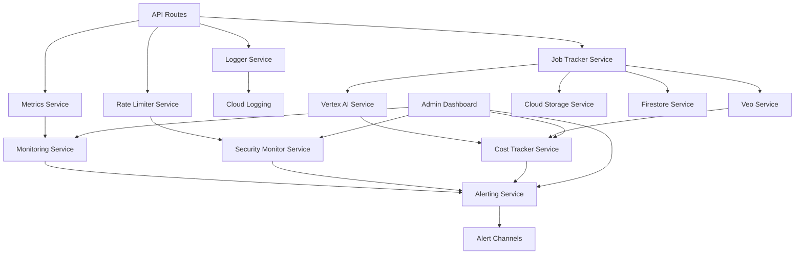

# Services Architecture Documentation

## Overview

AdCraft AI is built on a modular service-oriented architecture with 14 core services that handle everything from AI video generation to monitoring and security. Each service follows the singleton pattern and provides well-defined interfaces for clean separation of concerns.

## Core Architecture Principles

- **Singleton Pattern**: All services use singleton instances to ensure consistency and resource management
- **Dependency Injection**: Services are injected via constructors/parameters for testability
- **Error Boundaries**: Each service has isolated error handling and graceful degradation
- **Type Safety**: Full TypeScript strict mode with comprehensive type definitions
- **Observability**: Built-in logging, metrics, and monitoring for all services

## Service Categories

### AI & Generation Services
- [VertexAI Service](#vertexai-service) - Google Vertex AI integration
- [Veo Service](#veo-service) - Google DeepMind Veo video generation
- [Prompt Refiner Service](#prompt-refiner-service) - AI prompt optimization

### Infrastructure Services  
- [Cloud Storage Service](#cloud-storage-service) - Google Cloud Storage operations
- [Firestore Service](#firestore-service) - Firestore database operations
- [Job Tracker Service](#job-tracker-service) - Asynchronous job management

### Monitoring & Observability
- [Logger Service](#logger-service) - Structured logging with correlation IDs
- [Metrics Service](#metrics-service) - Performance and system metrics
- [Monitoring Service](#monitoring-service) - Health checks and system monitoring
- [Alerting Service](#alerting-service) - Rule-based alerting system
- [Cost Tracker Service](#cost-tracker-service) - Budget and cost management

### Security & Rate Limiting
- [Security Monitor Service](#security-monitor-service) - Security event tracking
- [Rate Limiter Service](#rate-limiter-service) - API rate limiting

---

## Service Detailed Documentation

### VertexAI Service

**Location**: `lib/services/vertex-ai.ts`

**Purpose**: Handles all Google Vertex AI operations including Gemini Pro Vision for image analysis and Gemini Pro for text generation.

#### Key Features
- Gemini Pro Vision for product image analysis
- Gemini Pro for conversational AI and text generation
- Automatic retry logic with exponential backoff
- Cost tracking integration
- Comprehensive error handling

#### Public Methods

```typescript
class VertexAIService {
  static getInstance(): VertexAIService
  
  // Image analysis using Gemini Pro Vision
  async analyzeImage(
    imageUrl: string, 
    prompt: string, 
    options?: AnalysisOptions
  ): Promise<ImageAnalysisResult>
  
  // Text generation using Gemini Pro
  async generateText(
    prompt: string, 
    options?: GenerationOptions
  ): Promise<TextGenerationResult>
  
  // Health check
  async healthCheck(): Promise<boolean>
  
  // Get service statistics
  getStats(): VertexAIStats
}
```

#### Configuration
- **Model**: Uses `gemini-1.5-pro` for balanced performance and cost
- **Region**: `asia-northeast1` for optimal latency in Japan
- **Timeout**: 30 seconds for API calls
- **Retry Policy**: Exponential backoff with 3 retries

#### Cost Information
- **Image Analysis**: ~$0.20-0.40 per analysis
- **Text Generation**: ~$0.10-0.20 per conversation turn
- **Budget Integration**: Automatically tracked via Cost Tracker Service

---

### Veo Service

**Location**: `lib/services/veo.ts`

**Purpose**: Integrates with Google DeepMind Veo for AI video generation from text prompts.

#### Key Features
- Real AI video generation using Veo 2 model
- Async job management with status polling
- Video quality optimization (1080p, 16:9 aspect ratio)
- Cost tracking and budget validation
- Comprehensive error handling and retry logic

#### Public Methods

```typescript
class VeoService {
  static getInstance(): VeoService
  
  // Generate video from text prompt
  async generateVideo(
    prompt: string, 
    options?: VideoGenerationOptions
  ): Promise<VideoGenerationResult>
  
  // Check generation status
  async checkGenerationStatus(operationId: string): Promise<GenerationStatus>
  
  // Get video file URL
  async getVideoUrl(operationId: string): Promise<string>
  
  // Health check
  async healthCheck(): Promise<boolean>
}
```

#### Video Specifications
- **Duration**: 5-15 seconds (configurable)
- **Resolution**: 1080p (1920x1080)
- **Aspect Ratio**: 16:9 for commercial use
- **Frame Rate**: 24 FPS
- **Format**: MP4 with H.264 codec

#### Cost Information
- **Per Video**: ~$1.50-1.80 per generation
- **Processing Time**: 5-8 minutes average
- **Success Rate**: >90% with retry logic

---

### Cloud Storage Service

**Location**: `lib/services/cloud-storage.ts`

**Purpose**: Manages Google Cloud Storage operations for user uploads, generated videos, and temporary files.

#### Key Features
- Secure file uploads with signed URLs
- Automatic file lifecycle management
- Image optimization and validation
- Virus scanning integration
- CDN-ready file delivery

#### Public Methods

```typescript
class CloudStorageService {
  static getInstance(): CloudStorageService
  
  // Upload file with validation
  async uploadFile(
    file: Buffer, 
    filename: string, 
    options?: UploadOptions
  ): Promise<UploadResult>
  
  // Generate signed URL for secure access
  async getSignedUrl(
    filename: string, 
    action: 'read' | 'write', 
    expiration?: Date
  ): Promise<string>
  
  // Delete file
  async deleteFile(filename: string): Promise<boolean>
  
  // List files with filtering
  async listFiles(prefix?: string, limit?: number): Promise<FileInfo[]>
  
  // Health check
  async healthCheck(): Promise<boolean>
}
```

#### Storage Buckets
- **User Uploads**: `adcraft-uploads-{environment}`
- **Generated Videos**: `adcraft-videos-{environment}`
- **Temporary Files**: `adcraft-temp-{environment}` (24-hour lifecycle)

#### Security Features
- Signed URLs with expiration (default: 1 hour)
- File type validation (images: JPEG, PNG; max 10MB)
- Automatic virus scanning
- Access logging for audit trails

---

### Logger Service

**Location**: `lib/services/logger.ts`

**Purpose**: Provides structured logging with correlation IDs, performance tracking, and Google Cloud Logging integration.

#### Key Features
- Structured JSON logging with correlation IDs
- Multiple log levels (DEBUG, INFO, WARN, ERROR, CRITICAL)
- Performance tracking with request/response timing
- Google Cloud Logging integration
- Log aggregation and search capabilities

#### Public Methods

```typescript
class Logger {
  static getInstance(): Logger
  
  // Logging methods
  debug(message: string, meta?: object): void
  info(message: string, meta?: object): void
  warn(message: string, meta?: object): void
  error(message: string, meta: object, error?: Error): void
  critical(message: string, meta: object, error?: Error): void
  
  // Utility methods
  generateCorrelationId(): string
  trackPerformance<T>(operation: string, fn: () => Promise<T>): Promise<T>
  
  // Metrics and monitoring
  getMetrics(): LoggerMetrics
  getRecentLogs(limit: number, level?: LogLevel): LogEntry[]
  
  // Health check
  healthCheck(): boolean
}
```

#### Log Structure
```typescript
interface LogEntry {
  timestamp: string
  level: LogLevel
  message: string
  correlationId?: string
  service?: string
  endpoint?: string
  duration?: number
  metadata?: object
  error?: {
    name: string
    message: string
    stack?: string
  }
}
```

---

### Metrics Service

**Location**: `lib/services/metrics.ts`

**Purpose**: Collects and analyzes performance metrics, API usage statistics, and system resource utilization.

#### Key Features
- Real-time performance monitoring
- API endpoint metrics (response time, success rate, error rate)
- System resource monitoring (CPU, memory, disk usage)
- Video generation metrics and success tracking
- Custom metrics support with aggregation

#### Public Methods

```typescript
class MetricsService {
  static getInstance(): MetricsService
  
  // Metric recording
  recordAPICall(endpoint: string, duration: number, status: number): void
  recordVideoGeneration(duration: number, cost: number, success: boolean): void
  recordCustomMetric(name: string, value: number, tags?: object): void
  
  // Metric retrieval
  getPerformanceSummary(timeRange?: string): PerformanceSummary
  getAPIMetrics(options?: MetricsOptions): APIMetrics[]
  getVideoGenerationMetrics(options?: MetricsOptions): VideoMetrics[]
  getSystemMetrics(timeRange?: string): SystemMetrics
  
  // Health and monitoring
  healthCheck(): boolean
  getActiveAlerts(): Alert[]
  startSystemMonitoring(): void
  stopSystemMonitoring(): void
}
```

#### Performance Metrics
- **API Response Time**: Average, P95, P99 percentiles
- **Success Rate**: Percentage of successful requests
- **Error Rate**: Categorized by HTTP status codes
- **Throughput**: Requests per minute/hour
- **System Resources**: CPU, memory, disk usage trends

---

### Cost Tracker Service

**Location**: `lib/services/cost-tracker.ts`

**Purpose**: Tracks and manages GCP service costs with budget alerts and optimization recommendations.

#### Key Features
- Real-time cost tracking for all GCP services
- Budget management with configurable thresholds
- Cost breakdown by service and operation type
- Alert system for budget thresholds (50%, 75%, 90%)
- Cost optimization recommendations

#### Public Methods

```typescript
class CostTracker {
  static getInstance(): CostTracker
  
  // Cost tracking
  trackCost(service: string, operation: string, amount: number): void
  
  // Budget management
  async getBudgetStatus(): Promise<BudgetStatus>
  setBudgetAlert(threshold: number, callback: () => void): void
  
  // Cost analysis
  async getDetailedMetrics(): Promise<CostMetrics>
  getCostBreakdown(timeRange?: string): CostBreakdown
  getOptimizationRecommendations(): Recommendation[]
  
  // Health and alerts
  async healthCheck(): Promise<boolean>
  getActiveAlerts(): CostAlert[]
}
```

#### Budget Configuration
- **Total Budget**: $300 (hackathon constraint)
- **Alert Thresholds**: 50% ($150), 75% ($225), 90% ($270)
- **Daily Limit**: $20 (to prevent runaway costs)
- **Per-Video Limit**: $3.00 (safety threshold)

#### Cost Breakdown
- **Vertex AI (Gemini)**: $0.20-0.40 per video
- **Veo Video Generation**: $1.50-1.80 per video
- **Cloud Storage**: $0.01-0.05 per video
- **Cloud Run**: $0.05-0.10 per video
- **Other Services**: <$0.05 per video

---

### Security Monitor Service

**Location**: `lib/services/security-monitor.ts`

**Purpose**: Monitors security events, detects threats, and tracks suspicious activities across the application.

#### Key Features
- Real-time security event detection
- IP-based threat tracking and automatic blocking
- Request pattern analysis for suspicious behavior
- Security metrics and reporting
- Integration with rate limiting and alerting

#### Public Methods

```typescript
class SecurityMonitorService {
  static getInstance(): SecurityMonitorService
  
  // Event tracking
  trackSecurityEvent(event: SecurityEvent): void
  trackSuspiciousActivity(source: string, activity: SuspiciousActivity): void
  
  // Threat detection
  analyzeRequest(request: SecurityContext): ThreatLevel
  isIPBlocked(ip: string): boolean
  blockIP(ip: string, duration?: number, reason?: string): void
  
  // Metrics and reporting
  getMetrics(): SecurityMetrics
  getRecentEvents(limit: number): SecurityEvent[]
  getTopSuspiciousSources(limit: number): SuspiciousSource[]
  exportSecurityReport(): SecurityReport
  
  // Health and alerts
  healthCheck(): boolean
  getActiveAlerts(): SecurityAlert[]
}
```

#### Security Event Types
- **Authentication Failures**: Failed login attempts, invalid tokens
- **Rate Limit Violations**: Excessive request patterns
- **Suspicious Requests**: Malformed requests, injection attempts
- **Data Access**: Unauthorized data access attempts
- **System Events**: Service failures, configuration changes

#### Threat Detection Rules
- **IP Blocking**: Auto-block after 10 failed requests in 5 minutes
- **Pattern Detection**: Identify bot-like behavior patterns
- **Payload Analysis**: Detect SQL injection, XSS attempts
- **Geographic Analysis**: Flag requests from suspicious regions

---

### Monitoring Service

**Location**: `lib/services/monitoring.ts`

**Purpose**: Orchestrates comprehensive system monitoring including health checks, performance tracking, and alerting coordination.

#### Key Features
- Comprehensive health check orchestration
- System status scoring (0-100 scale)
- Service dependency monitoring
- Performance trend analysis
- Integration with all monitoring services

#### Public Methods

```typescript
class MonitoringService {
  static getInstance(): MonitoringService
  
  // Health monitoring
  async performHealthCheck(): Promise<HealthStatus>
  async forceHealthCheck(): Promise<HealthStatus>
  getSystemStatus(): SystemStatusSummary
  
  // Dashboard data
  async getMonitoringDashboard(): Promise<MonitoringDashboard>
  
  // Configuration and control
  updateConfig(config: Partial<MonitoringConfig>): void
  getConfig(): MonitoringConfig
  startMonitoring(): void
  stopMonitoring(): void
  clearTrends(): void
  
  // Data export
  exportMonitoringData(startDate?: Date, endDate?: Date): MonitoringExport
  
  // Service stats
  getServiceStats(): MonitoringStats
}
```

#### Health Check Scoring
- **100**: All services healthy, optimal performance
- **80-99**: Minor issues, degraded performance
- **60-79**: Multiple service issues, significant degradation
- **40-59**: Major problems, limited functionality
- **0-39**: Critical failures, system instability

---

### Rate Limiter Service

**Location**: `lib/services/rate-limiter.ts`

**Purpose**: Implements sophisticated rate limiting with per-endpoint controls, IP-based limits, and budget-aware throttling.

#### Key Features
- Per-endpoint rate limiting configuration
- IP-based tracking with sliding window
- Budget-aware dynamic limit adjustment
- Memory-based storage for fast access
- Integration with security monitoring

#### Public Methods

```typescript
class RateLimiterService {
  static getInstance(): RateLimiterService
  
  // Rate limiting
  async checkLimit(
    key: string, 
    endpoint: string, 
    options?: RateLimitOptions
  ): Promise<RateLimitResult>
  
  async incrementUsage(key: string, endpoint: string): Promise<void>
  
  // Management
  async clearLimits(key?: string): Promise<void>
  async setCustomLimit(key: string, limit: number, window: number): Promise<void>
  
  // Monitoring
  getUsageStats(): RateLimitStats
  getTopUsers(limit: number): UserUsage[]
  healthCheck(): boolean
}
```

#### Rate Limit Configuration
```typescript
const RATE_LIMITS = {
  '/api/generate-video': {
    perHour: 1,
    perDay: 3,
    burstAllow: 0
  },
  '/api/chat/refine': {
    perHour: 60,
    perDay: 300,
    burstAllow: 10
  },
  '/api/status/*': {
    perHour: 600,
    perDay: 5000,
    burstAllow: 30
  }
}
```

---

### Job Tracker Service

**Location**: `lib/services/job-tracker.ts`

**Purpose**: Manages asynchronous job lifecycle including video generation, status tracking, and result delivery.

#### Key Features
- Async job lifecycle management
- Status tracking with real-time updates
- Job queuing and prioritization
- Result caching and delivery
- Automatic cleanup and archival

#### Public Methods

```typescript
class JobTracker {
  static getInstance(): JobTracker
  
  // Job management
  async createJob(type: string, params: object): Promise<string>
  async updateJobStatus(jobId: string, status: JobStatus, data?: object): Promise<void>
  async getJobStatus(jobId: string): Promise<JobStatusInfo>
  
  // Job execution
  async executeJob(jobId: string): Promise<JobResult>
  async cancelJob(jobId: string): Promise<boolean>
  
  // Monitoring
  getActiveJobs(): JobInfo[]
  getJobHistory(limit: number): JobInfo[]
  getJobStats(): JobTrackerStats
  
  // Cleanup
  async cleanupCompletedJobs(olderThan: Date): Promise<number>
  healthCheck(): boolean
}
```

#### Job Lifecycle States
1. **Created**: Job initialized but not started
2. **Queued**: Job waiting for available resources
3. **Processing**: Job actively being executed
4. **Completed**: Job finished successfully
5. **Failed**: Job encountered unrecoverable error
6. **Cancelled**: Job manually cancelled

---

### Alerting Service

**Location**: `lib/services/alerting.ts`

**Purpose**: Provides rule-based alerting system with multiple notification channels and intelligent alert management.

#### Key Features
- Rule-based alert configuration
- Multiple notification channels (console, email, webhook)
- Alert aggregation and deduplication
- Automatic alert resolution
- Alert history and analytics

#### Public Methods

```typescript
class AlertingService {
  static getInstance(): AlertingService
  
  // Rule management
  addRule(rule: Omit<AlertRule, 'createdAt' | 'updatedAt'>): string
  removeRule(ruleId: string): boolean
  toggleRule(ruleId: string, enabled: boolean): boolean
  getRules(): AlertRule[]
  
  // Alert management
  getActiveAlerts(): Alert[]
  getAlerts(options?: AlertQueryOptions): Alert[]
  resolveAlert(alertId: string): boolean
  
  // Monitoring
  getSummary(): AlertingSummary
  getStats(): AlertingStats
  
  // Configuration
  updateConfig(config: Partial<AlertingConfig>): void
  getConfig(): AlertingConfig
  startMonitoring(): void
  stopMonitoring(): void
}
```

#### Pre-configured Alert Rules
1. **High Error Rate**: >5% error rate for 5 minutes
2. **Slow Response Time**: >2s average response time
3. **Budget Exceeded**: Budget threshold breached
4. **Security Critical Events**: Critical security events detected
5. **High Memory Usage**: >90% memory utilization

---

### Prompt Refiner Service

**Location**: `lib/services/prompt-refiner.ts`

**Purpose**: Optimizes and refines AI prompts for better video generation results through iterative improvement.

#### Key Features
- Prompt optimization using AI feedback loops
- Context-aware refinement suggestions
- A/B testing for prompt effectiveness
- Template library with proven patterns
- Performance tracking and improvement metrics

#### Public Methods

```typescript
class PromptRefinerService {
  static getInstance(): PromptRefinerService
  
  // Prompt refinement
  async refinePrompt(
    originalPrompt: string, 
    context: RefinementContext
  ): Promise<RefinementResult>
  
  async suggestImprovements(
    prompt: string, 
    feedback: string
  ): Promise<ImprovementSuggestion[]>
  
  // Template management
  getTemplates(category?: string): PromptTemplate[]
  saveTemplate(template: PromptTemplate): string
  
  // Analytics
  getPromptPerformance(promptId?: string): PromptPerformanceMetrics
  healthCheck(): boolean
}
```

---

### Firestore Service

**Location**: `lib/services/firestore.ts`

**Purpose**: Manages Firestore database operations with optimized queries, caching, and real-time updates.

#### Key Features
- Optimized Firestore queries with caching
- Real-time data synchronization
- Document lifecycle management
- Batch operations for performance
- Comprehensive error handling

#### Public Methods

```typescript
class FirestoreService {
  static getInstance(): FirestoreService
  
  // Document operations
  async createDocument(collection: string, data: object, id?: string): Promise<string>
  async getDocument(collection: string, id: string): Promise<FirestoreDocument | null>
  async updateDocument(collection: string, id: string, data: object): Promise<void>
  async deleteDocument(collection: string, id: string): Promise<boolean>
  
  // Query operations
  async queryDocuments(
    collection: string, 
    query: FirestoreQuery
  ): Promise<FirestoreDocument[]>
  
  // Batch operations
  async batchWrite(operations: BatchOperation[]): Promise<void>
  
  // Health check
  async healthCheck(): Promise<boolean>
}
```

---

## Service Dependencies



## Configuration Management

All services support configuration through:
- Environment variables (production)
- Configuration files (development)
- Runtime configuration updates (admin endpoints)
- Pulumi infrastructure configuration

### Common Environment Variables
```bash
# Google Cloud
GOOGLE_CLOUD_PROJECT=adcraft-dev-2025
GOOGLE_APPLICATION_CREDENTIALS=/path/to/service-account.json

# Service Configuration
NODE_ENV=production
LOG_LEVEL=info
BUDGET_LIMIT=300
RATE_LIMIT_ENABLED=true

# Admin Access
ADMIN_API_KEY=your-secure-admin-key

# Monitoring
HEALTH_CHECK_INTERVAL=30000
ALERT_CHECK_INTERVAL=60000
METRICS_RETENTION_DAYS=30
```

## Error Handling Strategy

### Service-Level Error Handling
1. **Graceful Degradation**: Services continue operating with reduced functionality
2. **Circuit Breaker Pattern**: Automatic service isolation during failures
3. **Retry Logic**: Exponential backoff with configurable limits
4. **Error Propagation**: Structured error responses with correlation IDs

### Error Categories
- **Transient Errors**: Network timeouts, temporary service unavailability
- **Permanent Errors**: Invalid configuration, authentication failures
- **Resource Errors**: Budget exceeded, quota limits reached
- **Data Errors**: Invalid input, processing failures

## Testing Strategy

Each service includes comprehensive test coverage:

### Unit Tests
- Service initialization and singleton behavior
- Core functionality with mocked dependencies
- Error handling and edge cases
- Configuration management

### Integration Tests  
- Service interactions and data flow
- External API integration (with test accounts)
- Database operations and consistency
- End-to-end workflow validation

### Performance Tests
- Load testing with realistic traffic patterns
- Memory leak detection and resource usage
- Response time benchmarking
- Scalability testing

## Deployment Considerations

### Production Readiness
- **Health Checks**: All services implement health check endpoints
- **Graceful Shutdown**: Proper cleanup and resource deallocation
- **Configuration Validation**: Startup-time configuration verification
- **Resource Limits**: Memory and CPU constraints defined
- **Logging**: Structured logging for production debugging

### Scalability
- **Horizontal Scaling**: Services designed for multi-instance deployment
- **State Management**: Minimal shared state, prefer stateless operations
- **Caching**: Appropriate caching strategies for performance
- **Database Optimization**: Efficient queries and connection pooling

## Future Enhancements

### Planned Improvements
1. **Service Mesh Integration**: Istio for advanced traffic management
2. **Distributed Tracing**: OpenTelemetry for request tracing
3. **Advanced Analytics**: Machine learning for predictive monitoring
4. **Auto-scaling**: Dynamic resource allocation based on demand
5. **Disaster Recovery**: Cross-region backup and failover capabilities

---

This architecture provides a solid foundation for the AdCraft AI application with comprehensive monitoring, security, and scalability built-in from the start.