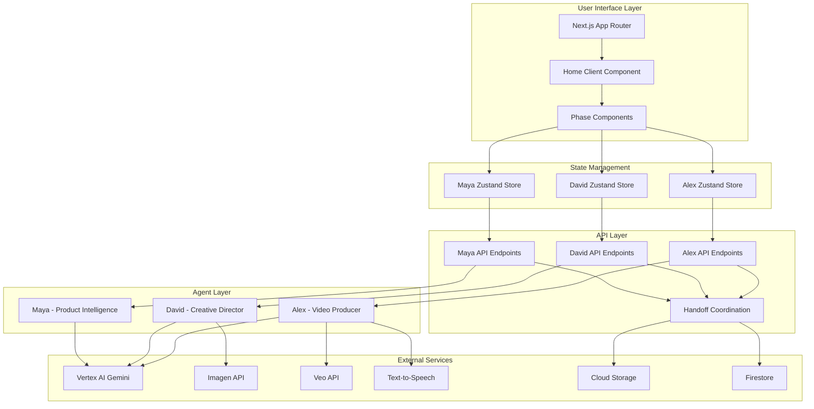
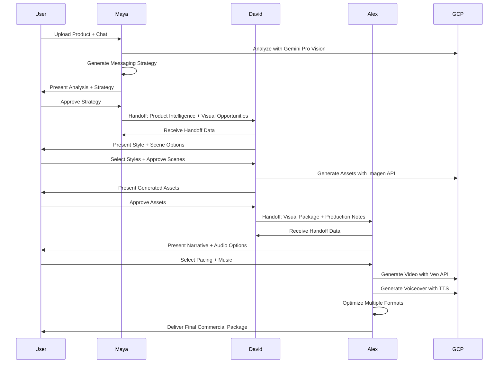

# Technical Design: 3-Agent Architecture Migration

## Executive Summary

This document outlines the comprehensive technical design for migrating AdCraft AI from the current 2-agent system with overlapping responsibilities to a clean 3-agent architecture with specialized roles. The migration preserves all existing functionality while redistributing responsibilities for enhanced creative control and professional production capabilities.

**IMPORTANT: This migration focuses on Maya/David scope redistribution only. Alex agent implementation is deferred to a future initiative.**

## Architectural Decisions Summary

Based on user approval (September 14, 2025), the following architectural patterns will be implemented:

### APPROVED DECISIONS:
1. **Agent Handoff Data Storage**: **SELECTED: Option B - Persistent Firestore Storage**
   - Firestore documents for reliable handoff data persistence
   - Session-based document structure for data integrity
   - Automatic cleanup after 48 hours

2. **Scene Generation Migration**: **SELECTED: Option A - Direct Code Migration**
   - Move scene generation logic from Maya to David preserving existing implementation
   - Import visual analysis tools to David's scope
   - Maintain proven algorithms and logic patterns

3. **State Management Architecture**: **SELECTED: Option B - Independent Agent Stores**
   - Separate Zustand stores for Maya, David, and Alex
   - Handoff coordination through dedicated API layer
   - Store isolation for better performance and maintainability

4. **UI Layout Strategy**: **SELECTED: Option A - Consistent Left/Right Layout**
   - Standardized left panel (chat/decisions) and right panel (outputs/approvals)
   - Consistent layout pattern across all agent phases
   - Familiar user experience maintained throughout workflow

5. **Cost Allocation Strategy**: **SELECTED: Option B - Session-Level Cost Tracking**
   - Single cost tracker per session across all agents
   - Simplified budget management and monitoring
   - Clear cost breakdowns per agent while maintaining session totals

6. **Implementation Priority**: **Maya/David migration only - Alex agent implementation DEFERRED**
   - Focus on Maya simplification and David enhancement
   - Alex design preserved for future implementation
   - Two-phase approach: Current migration + Future Alex implementation

## Current State Analysis

### Current Agent Implementation

#### Maya (Product Intelligence Agent) - Current Implementation
```typescript
// Current scope includes both core and non-core responsibilities
interface MayaCurrentScope {
  // ✅ CORE (KEEP) - Product Intelligence
  productAnalysis: ProductInfo;
  targetAudience: TargetAudience;
  positioning: Positioning;
  keyMessages: KeyMessages;

  // ❌ NON-CORE (MOVE OUT) - Visual/Audio Decisions
  visualPreferences: VisualPreferences; // → Move to David
  keyScenes: KeyScenes;                 // → Move to David
  musicTone: MusicToneDecisions;        // → Move to Alex
}
```

#### David (Creative Director Agent) - Current Implementation
```typescript
// Currently underutilized with basic creative direction
interface DavidCurrentScope {
  // ✅ EXISTING (EXPAND)
  visualAssets: VisualAsset[];
  creativeDirection: CreativeDirection;

  // ❌ MISSING (NEEDS ENHANCEMENT)
  sceneComposition: SceneComposition;   // Import from Maya
  visualStyleDecisions: StyleDecisions; // Import from Maya
  interactiveCreativeFlow: CreativeWorkflow; // New implementation
}
```

#### Alex (Video Producer Agent) - Current Implementation
```typescript
// Currently exists only as placeholder references
interface AlexCurrentScope {
  // ❌ NOT IMPLEMENTED - Needs complete creation
  productionDecisions: ProductionPlan;
  audioCoordination: AudioPlan;
  videoGeneration: VeoIntegration;
}
```

### Current Technical Architecture

#### File Structure (Current)
```
lib/agents/
├── product-intelligence/           # Maya - Overloaded
│   ├── tools/scene-generator.ts   # → Move to David
│   ├── tools/visual-analyzer.ts   # → Move to David
│   └── core/music-logic.ts        # → Move to Alex
├── creative-director/              # David - Underutilized
│   └── [basic implementation]
└── video-producer/                 # Alex - Missing
    └── [needs creation]
```

#### State Management (Current)
```typescript
// Current Zustand stores
useProductIntelligenceStore {
  // ✅ KEEP - Core Maya responsibilities
  analysis: ProductAnalysis;
  messages: ChatMessage[];

  // ❌ MOVE OUT - Non-core responsibilities
  expandedSections: {
    visualStyle: boolean;    // → Move to David store
    keyScenes: boolean;      // → Move to David store
    musicTone: boolean;      // → Move to Alex store
  };
}

useCreativeDirectorStore {
  // ✅ EXPAND - Enhance existing implementation
  creativeDirection: CreativeDirection;

  // ❌ ADD - Import from Maya
  sceneComposition: SceneComposition;
  visualStyleDecisions: StyleDecisions;
}

// ❌ MISSING - Create new store
useVideoProducerStore {
  // New implementation needed
}
```

## Target Architecture Design

### Agent 1: Maya (Product Intelligence Agent) - Refined Implementation

#### Core Responsibilities (Focused Scope)
```typescript
interface MayaRefinedScope {
  // ✅ CORE INTELLIGENCE - Enhanced focus
  productAnalysis: {
    product: ProductInfo;
    targetAudience: TargetAudience;
    positioning: Positioning;
    marketInsights: MarketInsights; // Enhanced
  };

  // ✅ MESSAGING STRATEGY - Enhanced capabilities
  messagingStrategy: {
    keyMessages: KeyMessages;
    communicationFramework: CommunicationFramework; // New
    audiencePersonas: AudiencePersonas; // Enhanced
    brandNarrative: BrandNarrative; // New
  };

  // ✅ STRATEGIC INSIGHTS - New capability
  strategicInsights: {
    competitiveAnalysis: CompetitiveAnalysis; // New
    marketOpportunities: MarketOpportunities; // New
    brandPositioning: BrandPositioning; // Enhanced
  };
}
```

#### Handoff Output to David
```typescript
interface MayaToDataHandoff {
  // Product understanding
  productIntelligence: {
    analysis: ProductAnalysis;
    strategicInsights: StrategicInsights;
    messagingFramework: MessagingFramework;
  };

  // Visual guidance (strategic, not tactical)
  visualOpportunities: {
    brandAlignment: BrandAlignment;
    audiencePreferences: AudienceVisualPreferences;
    messagingVisualCues: VisualMessagingCues;
  };

  // Session context
  sessionMetadata: {
    sessionId: string;
    conversationHistory: ChatMessage[];
    userPreferences: UserPreferences;
  };
}
```

#### Implementation Changes for Maya
```typescript
// Remove from Maya's product-analysis.ts
interface ProductAnalysisRefined {
  product: ProductInfo;
  targetAudience: TargetAudience;
  positioning: Positioning;
  commercialStrategy: {
    keyMessages: KeyMessages;
    emotionalTriggers: EmotionalTriggers;
    callToAction: CallToAction;
    storytelling: Storytelling;
    // ❌ REMOVE: keyScenes (move to David)
    // ❌ REMOVE: visualPreferences (move to David)
  };
  metadata: AnalysisMetadata;
}
```

### Agent 2: David (Creative Director Agent) - Expanded Implementation

#### Enhanced Responsibilities
```typescript
interface DavidExpandedScope {
  // ✅ IMPORT FROM MAYA - Scene Planning
  sceneComposition: {
    keyScenes: KeyScenes;           // Import from Maya
    visualFlow: VisualFlow;         // New
    cinematicStructure: CinematicStructure; // New
  };

  // ✅ IMPORT FROM MAYA - Visual Style
  visualDirection: {
    styleRecommendation: VisualStyle;     // Import from Maya
    colorPalette: ColorPalette;           // Enhanced
    moodBoard: MoodBoard;                 // New
    brandVisualIdentity: BrandVisual;     // New
  };

  // ✅ ENHANCED - Asset Generation
  assetGeneration: {
    backgrounds: BackgroundAssets;
    productShots: ProductShotAssets;
    lifestyleContexts: LifestyleAssets;
    visualOverlays: OverlayAssets;
  };

  // ✅ NEW - Interactive Creative Flow
  creativeWorkflow: {
    styleSelection: StyleSelectionProcess;
    sceneApproval: SceneApprovalProcess;
    assetIteration: AssetIterationProcess;
  };
}
```

#### Handoff Input from Maya
```typescript
interface DavidReceivesFromMaya {
  // Strategic context
  productIntelligence: ProductAnalysis;
  messagingFramework: MessagingFramework;
  brandGuidelines: BrandGuidelines;

  // Visual opportunities
  visualOpportunities: {
    brandAlignment: BrandAlignment;
    audienceVisualPreferences: AudienceVisualPreferences;
    messagingVisualCues: VisualMessagingCues;
  };
}
```

#### Handoff Output to Alex
```typescript
interface DavidToAlexHandoff {
  // Complete visual package
  visualDirection: {
    approvedStyle: VisualStyle;
    finalColorPalette: ColorPalette;
    brandVisualIdentity: BrandVisualIdentity;
  };

  // Scene composition
  sceneComposition: {
    finalScenes: KeyScenes;
    visualFlow: VisualFlow;
    cinematicTiming: CinematicTiming;
  };

  // Generated assets
  visualAssets: {
    backgrounds: GeneratedAsset[];
    productShots: GeneratedAsset[];
    lifestyleContexts: GeneratedAsset[];
    overlays: GeneratedAsset[];
  };

  // Production guidance
  productionNotes: {
    visualRequirements: VisualRequirements;
    technicalSpecs: TechnicalSpecs;
    qualityGuidelines: QualityGuidelines;
  };
}
```

#### File Migration for David
```bash
# Import scene generation from Maya
lib/agents/product-intelligence/tools/scene-generator.ts
  → lib/agents/creative-director/tools/scene-composer.ts

# Import visual analysis from Maya
lib/agents/product-intelligence/tools/visual-analyzer.ts
  → lib/agents/creative-director/tools/visual-direction-engine.ts

# Enhance existing creative tools
lib/agents/creative-director/tools/style-generator.ts
  → Enhanced with Maya's visual preferences logic
```

### Agent 3: Alex (Video Producer Agent) - New Implementation

#### Complete New Implementation
```typescript
interface AlexNewImplementation {
  // ✅ NEW - Narrative Direction
  narrativeDirection: {
    pacingDecisions: PacingDecisions;     // New
    narrationStyle: NarrationStyle;       // New
    storytellingFlow: StorytellingFlow;   // New
  };

  // ✅ NEW - Audio Coordination
  audioCoordination: {
    musicSelection: MusicSelection;       // Import from Maya
    audioMixing: AudioMixing;             // New
    soundDesign: SoundDesign;             // New
    voiceoverCoordination: VoiceoverCoordination; // New
  };

  // ✅ NEW - Video Production
  videoProduction: {
    veoIntegration: VeoAPIIntegration;    // New
    formatOptimization: FormatOptimization; // New
    qualityAssurance: QualityAssurance;   // New
    deliveryPreparation: DeliveryPrep;    // New
  };

  // ✅ NEW - Production Polish
  productionPolish: {
    colorGrading: ColorGrading;           // New
    transitionEffects: TransitionEffects; // New
    timingRefinement: TimingRefinement;   // New
    finalMixing: FinalMixing;             // New
  };
}
```

#### Handoff Input from David
```typescript
interface AlexReceivesFromDavid {
  // Visual foundation
  visualDirection: CompleteVisualDirection;
  sceneComposition: FinalSceneComposition;
  visualAssets: GeneratedVisualAssets;

  // Production guidance
  productionNotes: ProductionRequirements;
  technicalSpecs: TechnicalSpecifications;
  qualityGuidelines: QualityStandards;
}
```

#### Final Output
```typescript
interface AlexFinalOutput {
  // Commercial video
  finalVideo: {
    videoFile: VideoFile;
    formats: VideoFormat[]; // 16:9, 1:1, 9:16
    quality: VideoQuality;  // 1080p, metadata
  };

  // Production metadata
  productionMetadata: {
    processingTime: number;
    qualityMetrics: QualityMetrics;
    costBreakdown: CostBreakdown;
    technicalDetails: TechnicalDetails;
  };

  // Delivery package
  deliveryPackage: {
    videoFiles: VideoFile[];
    thumbnails: Thumbnail[];
    metadata: VideoMetadata;
    costReport: CostReport;
  };
}
```

#### New File Structure for Alex
```bash
lib/agents/video-producer/                    # New directory
├── core/
│   ├── demo-handler.ts                      # New - Demo mode
│   ├── real-handler.ts                      # New - Real mode
│   ├── production-engine.ts                 # New - Core logic
│   └── chat.ts                              # New - Alex personality
├── tools/
│   ├── narrative-director.ts                # New - Pacing/style
│   ├── audio-coordinator.ts                 # Import from Maya + enhance
│   ├── veo-integration.ts                   # New - Video generation
│   ├── format-optimizer.ts                 # New - Multi-format output
│   └── quality-assurance.ts                # New - QA systems
├── types/
│   ├── production-types.ts                  # New - Production types
│   ├── audio-types.ts                       # New - Audio types
│   └── video-types.ts                       # New - Video types
├── enums.ts                                 # New - Alex enums
└── index.ts                                 # New - Public API
```

## Data Model Redesign

### Updated Type Definitions

#### Refined Maya Types
```typescript
// lib/agents/product-intelligence/types/product-analysis.ts (Updated)
export interface ProductAnalysisRefined {
  // Core product intelligence (KEEP)
  product: ProductInfo;
  targetAudience: TargetAudience;
  positioning: Positioning;

  // Enhanced messaging strategy (ENHANCE)
  messagingStrategy: {
    keyMessages: KeyMessages;
    communicationFramework: CommunicationFramework;
    brandNarrative: BrandNarrative;
    audiencePersonas: EnhancedAudiencePersonas;
  };

  // Strategic insights (NEW)
  strategicInsights: {
    competitiveAnalysis: CompetitiveAnalysis;
    marketOpportunities: MarketOpportunities;
    brandPositioning: EnhancedBrandPositioning;
  };

  // Simplified commercial strategy (REFINED)
  commercialStrategy: {
    emotionalTriggers: EmotionalTriggers;
    callToAction: CallToAction;
    storytelling: Storytelling;
    // ❌ REMOVED: keyScenes, visualPreferences
  };

  metadata: AnalysisMetadata;
}
```

#### New David Types
```typescript
// lib/agents/creative-director/types/creative-direction.ts (Enhanced)
export interface CreativeDirectionEnhanced {
  // Scene composition (IMPORT FROM MAYA)
  sceneComposition: {
    keyScenes: KeyScenes;
    visualFlow: VisualFlow;
    cinematicStructure: CinematicStructure;
    sceneTransitions: SceneTransitions;
  };

  // Visual direction (IMPORT FROM MAYA + ENHANCE)
  visualDirection: {
    approvedStyle: VisualStyle;
    colorPalette: EnhancedColorPalette;
    moodBoard: MoodBoard;
    brandVisualIdentity: BrandVisualIdentity;
    lightingDesign: LightingDesign;
  };

  // Asset management (ENHANCED)
  assetManagement: {
    generatedAssets: VisualAsset[];
    approvedAssets: VisualAsset[];
    assetMetadata: AssetMetadata[];
  };

  // Production guidance for Alex (NEW)
  productionGuidelines: {
    visualRequirements: VisualRequirements;
    technicalSpecs: TechnicalSpecs;
    qualityStandards: QualityStandards;
  };
}
```

#### New Alex Types
```typescript
// lib/agents/video-producer/types/production-types.ts (NEW)
export interface ProductionPlan {
  // Narrative decisions
  narrativeDirection: {
    pacing: PacingDecisions;
    narrationStyle: NarrationStyle;
    storytellingApproach: StorytellingApproach;
    emotionalArc: EmotionalArc;
  };

  // Audio coordination
  audioCoordination: {
    musicSelection: MusicSelection;
    audioMixing: AudioMixingPlan;
    soundDesign: SoundDesignPlan;
    voiceover: VoiceoverPlan;
  };

  // Video production
  videoProduction: {
    veoConfiguration: VeoAPIConfiguration;
    formatSpecifications: FormatSpecifications;
    qualitySettings: QualitySettings;
    renderingPlan: RenderingPlan;
  };

  // Final polish
  postProduction: {
    colorGrading: ColorGradingPlan;
    transitions: TransitionEffectsConfig;
    timing: TimingAdjustments;
    finalMix: FinalMixingConfig;
  };
}
```

### Handoff Data Structures

#### Maya → David Handoff
```typescript
export interface MayaToDataHandoffData {
  // Core intelligence
  productIntelligence: {
    analysis: ProductAnalysisRefined;
    strategicInsights: StrategicInsights;
    messagingFramework: MessagingFramework;
  };

  // Visual opportunities (strategic guidance)
  visualOpportunities: {
    brandAlignment: BrandAlignment;
    audiencePreferences: AudienceVisualPreferences;
    messagingCues: VisualMessagingCues;
    styleOpportunities: StyleOpportunities;
  };

  // Session context
  sessionContext: {
    sessionId: string;
    userPreferences: UserPreferences;
    conversationHistory: ChatMessage[];
    approvedDecisions: ApprovedDecisions[];
  };

  // Handoff metadata
  handoffMetadata: {
    timestamp: string;
    mayaConfidence: number;
    processingTime: number;
    costIncurred: number;
  };
}
```

#### David → Alex Handoff
```typescript
export interface DavidToAlexHandoffData {
  // Complete visual package
  visualPackage: {
    finalDirection: CreativeDirectionEnhanced;
    approvedAssets: VisualAsset[];
    visualFlow: VisualFlow;
    brandGuidelines: BrandGuidelines;
  };

  // Production requirements
  productionRequirements: {
    technicalSpecs: TechnicalSpecs;
    qualityStandards: QualityStandards;
    deliveryFormats: DeliveryFormat[];
    timelineRequirements: TimelineRequirements;
  };

  // Creative context
  creativeContext: {
    approvedDecisions: CreativeDecision[];
    userFeedback: UserFeedback[];
    iterationHistory: IterationHistory[];
  };

  // Handoff metadata
  handoffMetadata: {
    timestamp: string;
    davidConfidence: number;
    processingTime: number;
    costIncurred: number;
    assetsGenerated: number;
  };
}
```

## API Endpoint Restructuring

### Maya API Refinement
```typescript
// app/api/agents/product-intelligence/ (REFINED)
├── route.ts                    // Main analysis endpoint (REFINED)
├── analyze/route.ts            // Product analysis (ENHANCED)
├── strategy/route.ts           // Messaging strategy (NEW)
├── insights/route.ts           // Strategic insights (NEW)
├── chat/
│   ├── route.ts               // Chat system (PRESERVED)
│   └── confirm-strategy/route.ts // Strategy confirmation (PRESERVED)
├── upload/route.ts            // File upload (PRESERVED)
├── events/route.ts            // SSE events (PRESERVED)
└── handoff/
    └── david/route.ts         // Maya→David handoff (ENHANCED)
```

### David API Enhancement
```typescript
// app/api/agents/creative-director/ (ENHANCED)
├── route.ts                   // Main creative endpoint (ENHANCED)
├── initialize/route.ts        // Maya handoff initialization (NEW)
├── style/
│   ├── selection/route.ts     // Style selection process (NEW)
│   └── approval/route.ts      // Style approval (NEW)
├── scenes/
│   ├── composition/route.ts   // Scene composition (IMPORT FROM MAYA)
│   └── approval/route.ts      // Scene approval (NEW)
├── assets/
│   ├── generate/route.ts      // Asset generation (ENHANCED)
│   ├── approve/route.ts       // Asset approval (NEW)
│   └── iterate/route.ts       // Asset iteration (NEW)
├── chat/
│   ├── route.ts              // Creative chat (ENHANCED)
│   └── decisions/route.ts     // Creative decisions (NEW)
└── handoff/
    └── alex/route.ts          // David→Alex handoff (NEW)
```

### Alex API Creation
```typescript
// app/api/agents/video-producer/ (NEW)
├── route.ts                   // Main production endpoint (NEW)
├── initialize/route.ts        // David handoff initialization (NEW)
├── narrative/
│   ├── style/route.ts         // Narrative style selection (NEW)
│   └── pacing/route.ts        // Pacing decisions (NEW)
├── audio/
│   ├── music/route.ts         // Music selection (NEW)
│   ├── mixing/route.ts        // Audio mixing (NEW)
│   └── voiceover/route.ts     // Voiceover coordination (NEW)
├── production/
│   ├── generate/route.ts      // Video generation (NEW)
│   ├── quality/route.ts       // Quality assurance (NEW)
│   └── formats/route.ts       // Format optimization (NEW)
├── chat/
│   ├── route.ts              // Production chat (NEW)
│   └── decisions/route.ts     // Production decisions (NEW)
└── delivery/
    └── finalize/route.ts      // Final delivery (NEW)
```

## State Management Migration

### Updated Zustand Stores

#### Maya Store Refinement
```typescript
// lib/stores/product-intelligence-store.ts (REFINED)
interface ProductIntelligenceStoreRefined {
  // ✅ KEEP - Core Maya state
  sessionId: string;
  analysis: ProductAnalysisRefined; // Updated type
  messages: ChatMessage[];
  chatInputMessage: string;

  // ✅ KEEP - UI state relevant to Maya
  currentStep: 'upload' | 'analyze' | 'strategy' | 'handoff';
  showCommercialChat: boolean;

  // ✅ REFINED - Accordion sections (Maya-specific only)
  expandedSections: {
    keyMessages: boolean;
    targetAudience: boolean;
    positioning: boolean;
    strategicInsights: boolean;
    // ❌ REMOVED: visualStyle, keyScenes, musicTone
  };

  // ✅ NEW - Handoff preparation
  handoffPreparation: {
    strategyFinalized: boolean;
    readyForDavid: boolean;
    davidHandoffData: MayaToDataHandoffData | null;
  };

  // Actions (refined)
  // ... refined action set
}
```

#### David Store Enhancement
```typescript
// lib/stores/creative-director-store.ts (ENHANCED)
interface CreativeDirectorStoreEnhanced {
  // ✅ EXISTING - Preserve current state
  sessionId: string;
  creativeDirection: CreativeDirectionEnhanced; // Updated type
  messages: CreativeChatMessage[];
  chatInputMessage: string;

  // ✅ NEW - Maya handoff state
  mayaHandoffData: MayaToDataHandoffData | null;

  // ✅ NEW - Scene composition state (from Maya)
  sceneComposition: {
    currentScenes: KeyScenes | null;
    sceneApprovals: SceneApproval[];
    visualFlow: VisualFlow | null;
  };

  // ✅ NEW - Style decision state (from Maya)
  styleDecisions: {
    selectedStyle: VisualStyle | null;
    colorPalette: ColorPalette | null;
    styleApprovals: StyleApproval[];
  };

  // ✅ ENHANCED - Accordion sections
  expandedSections: {
    // Existing
    visualDirection: boolean;
    colorPalette: boolean;
    assetGeneration: boolean;

    // New from Maya
    sceneComposition: boolean;
    styleSelection: boolean;
    productionPrep: boolean;
  };

  // ✅ NEW - Alex handoff preparation
  handoffPreparation: {
    visualFinalized: boolean;
    assetsApproved: boolean;
    productionNotesComplete: boolean;
    readyForAlex: boolean;
    alexHandoffData: DavidToAlexHandoffData | null;
  };

  // Enhanced actions
  initializeFromMayaHandoff: (data: MayaToDataHandoffData) => void;
  updateSceneComposition: (scenes: KeyScenes) => void;
  updateStyleDecisions: (style: StyleDecisions) => void;
  prepareAlexHandoff: () => void;
  // ... other enhanced actions
}
```

#### Alex Store Creation
```typescript
// lib/stores/video-producer-store.ts (NEW)
interface VideoProducerStore {
  // Session state
  sessionId: string;
  sessionStatus: SessionStatus;
  isConnected: boolean;
  isAgentTyping: boolean;

  // David handoff state
  davidHandoffData: DavidToAlexHandoffData | null;

  // Narrative direction state
  narrativeDirection: {
    selectedPacing: PacingDecisions | null;
    narrationStyle: NarrationStyle | null;
    narrativeApprovals: NarrativeApproval[];
  };

  // Audio coordination state
  audioCoordination: {
    selectedMusic: MusicSelection | null;
    audioMixing: AudioMixingPlan | null;
    voiceoverPlan: VoiceoverPlan | null;
    audioApprovals: AudioApproval[];
  };

  // Video production state
  videoProduction: {
    productionStatus: ProductionStatus;
    veoConfiguration: VeoAPIConfiguration | null;
    formatSettings: FormatSpecifications | null;
    qualityMetrics: QualityMetrics | null;
  };

  // Chat state
  messages: ProductionChatMessage[];
  chatInputMessage: string;

  // UI state
  currentPhase: ProductionPhase;
  showProductionChat: boolean;
  showQualityAssurance: boolean;
  showDeliveryPreview: boolean;

  // Accordion sections
  expandedSections: {
    narrativeDirection: boolean;
    audioCoordination: boolean;
    videoProduction: boolean;
    qualityAssurance: boolean;
    finalDelivery: boolean;
  };

  // Cost tracking
  costTracking: {
    current: number;
    veoApiCosts: number;
    audioProcessingCosts: number;
    totalProduction: number;
  };

  // Final output state
  finalOutput: {
    videoFiles: VideoFile[];
    deliveryPackage: DeliveryPackage | null;
    productionMetadata: ProductionMetadata | null;
  };

  // Actions
  initializeFromDavidHandoff: (data: DavidToAlexHandoffData) => void;
  updateNarrativeDirection: (narrative: NarrativeDirection) => void;
  updateAudioCoordination: (audio: AudioCoordination) => void;
  updateVideoProduction: (production: VideoProduction) => void;
  setChatInputMessage: (message: string) => void;
  addMessage: (message: ProductionChatMessage) => void;
  finalizeProduction: () => void;
  resetSession: () => void;
  // ... other actions
}

export const useVideoProducerStore = create<VideoProducerStore>((set, get) => ({
  // Implementation...
}));
```

## Component Architecture Updates

### Updated Phase Management
```typescript
// lib/types/app-phases.ts (UPDATED)
export type AppPhase =
  | 'product-input'      // Initial product upload/description
  | 'maya-analysis'      // Maya analyzing product
  | 'maya-strategy'      // Maya showing strategy, messaging chat
  | 'maya-handoff'       // Maya preparing handoff to David
  | 'david-creative'     // David's creative direction workflow
  | 'david-scenes'       // David's scene composition
  | 'david-assets'       // David's asset generation
  | 'david-handoff'      // David preparing handoff to Alex
  | 'alex-narrative'     // Alex's narrative direction
  | 'alex-audio'         // Alex's audio coordination
  | 'alex-production'    // Alex's video production
  | 'alex-delivery'      // Alex's final delivery
  | 'completed';         // Workflow complete

export const PHASE_ORDER: AppPhase[] = [
  'product-input',
  'maya-analysis',
  'maya-strategy',
  'maya-handoff',
  'david-creative',
  'david-scenes',
  'david-assets',
  'david-handoff',
  'alex-narrative',
  'alex-audio',
  'alex-production',
  'alex-delivery',
  'completed'
];

export const PHASE_AGENTS: Record<AppPhase, string> = {
  'product-input': 'user',
  'maya-analysis': 'maya',
  'maya-strategy': 'maya',
  'maya-handoff': 'maya',
  'david-creative': 'david',
  'david-scenes': 'david',
  'david-assets': 'david',
  'david-handoff': 'david',
  'alex-narrative': 'alex',
  'alex-audio': 'alex',
  'alex-production': 'alex',
  'alex-delivery': 'alex',
  'completed': 'system'
};
```

### UI Component Restructuring

#### Maya Components (Refined)
```typescript
// components/product-intelligence/ (REFINED)
├── ChatContainer.tsx           // PRESERVED - Maya's chat
├── ImageUploadArea.tsx         // PRESERVED - Image upload
├── TextInputArea.tsx           // PRESERVED - Text input
├── ProductAnalysisCard.tsx     // REFINED - Core analysis only
├── MessagingStrategyCard.tsx   // NEW - Enhanced messaging focus
├── StrategicInsightsCard.tsx   // NEW - Market insights
├── TargetAudienceCard.tsx      // ENHANCED - Deeper audience analysis
└── HandoffPreparationCard.tsx  // NEW - David handoff preparation
```

#### David Components (Enhanced)
```typescript
// components/creative-director/ (ENHANCED)
├── CreativeChatContainer.tsx     // PRESERVED - David's chat
├── MayaHandoffCard.tsx          // NEW - Receive Maya's handoff
├── StyleSelectionCard.tsx       // NEW - Interactive style selection
├── SceneCompositionCard.tsx     // NEW - Scene planning interface
├── VisualDirectionCard.tsx      // ENHANCED - Visual decision making
├── AssetGenerationCard.tsx      // ENHANCED - Asset creation workflow
├── AssetGalleryCard.tsx         // ENHANCED - Asset review/approval
├── ProductionNotesCard.tsx      // NEW - Alex handoff preparation
└── AlexHandoffCard.tsx          // NEW - Alex handoff interface
```

#### Alex Components (New)
```typescript
// components/video-producer/ (NEW)
├── ProductionChatContainer.tsx   // NEW - Alex's chat interface
├── DavidHandoffCard.tsx         // NEW - Receive David's handoff
├── NarrativeDirectionCard.tsx   // NEW - Narrative style selection
├── AudioCoordinationCard.tsx    // NEW - Music and audio planning
├── ProductionControlCard.tsx    // NEW - Video generation controls
├── QualityAssuranceCard.tsx     // NEW - Quality review interface
├── FormatOptimizationCard.tsx   // NEW - Multi-format delivery
├── DeliveryPackageCard.tsx      // NEW - Final delivery interface
└── ProductionProgressCard.tsx   // NEW - Production progress tracking
```

### Layout Updates for Agent Specialization

#### Left/Right Layout Pattern
```typescript
// Each agent phase uses consistent left/right layout
interface AgentPhaseLayout {
  leftPanel: {
    // Agent conversation and decisions
    chatContainer: ChatContainer;
    agentPersonality: AgentPersonalityCard;
    quickActions: QuickActionButtons;
  };

  rightPanel: {
    // Agent outputs and user review
    outputDisplays: AgentOutputCard[];
    approvalInterfaces: ApprovalCard[];
    handoffPreparation: HandoffCard;
  };
}

// Maya Phase Layout
<MayaPhaseLayout>
  <LeftPanel>
    <MayaChatContainer />
    <MessagingStrategyActions />
  </LeftPanel>
  <RightPanel>
    <ProductAnalysisCard />
    <MessagingStrategyCard />
    <StrategicInsightsCard />
    <DavidHandoffCard />
  </RightPanel>
</MayaPhaseLayout>

// David Phase Layout
<DavidPhaseLayout>
  <LeftPanel>
    <DavidChatContainer />
    <CreativeDecisionActions />
  </LeftPanel>
  <RightPanel>
    <StyleSelectionCard />
    <SceneCompositionCard />
    <AssetGenerationCard />
    <AlexHandoffCard />
  </RightPanel>
</DavidPhaseLayout>

// Alex Phase Layout
<AlexPhaseLayout>
  <LeftPanel>
    <AlexChatContainer />
    <ProductionDecisionActions />
  </LeftPanel>
  <RightPanel>
    <NarrativeDirectionCard />
    <AudioCoordinationCard />
    <ProductionControlCard />
    <DeliveryPackageCard />
  </RightPanel>
</AlexPhaseLayout>
```

## External Service Integration

### Google Cloud API Distribution

#### Maya's GCP Integration (Focused)
```typescript
// Maya uses Vertex AI for core intelligence
interface MayaGCPIntegration {
  vertexAI: {
    geminiProVision: ProductImageAnalysis;
    geminiPro: MessagingStrategyGeneration;
    geminiPro: StrategicInsightsGeneration;
  };

  costTracking: {
    analysisAPI: GeminiAnalysisCosts;
    chatInteractions: GeminiChatCosts;
  };
}
```

#### David's GCP Integration (Enhanced)
```typescript
// David uses Imagen API for visual assets
interface DavidGCPIntegration {
  vertexAI: {
    geminiPro: SceneCompositionGeneration;
    geminiPro: VisualStyleRecommendations;
  };

  imagenAPI: {
    backgroundGeneration: BackgroundAssets;
    productShotGeneration: ProductShotAssets;
    lifestyleContextGeneration: LifestyleAssets;
    overlayGeneration: OverlayAssets;
  };

  costTracking: {
    creativeDecisionAPI: GeminiCreativeCosts;
    assetGenerationAPI: ImagenAPICosts;
  };
}
```

#### Alex's GCP Integration (New)
```typescript
// Alex uses Veo API and Text-to-Speech
interface AlexGCPIntegration {
  vertexAI: {
    geminiPro: ProductionDecisionGeneration;
    geminiPro: QualityAssuranceAnalysis;
  };

  veoAPI: {
    videoGeneration: CommercialVideoGeneration;
    formatOptimization: MultiFormatOutput;
    qualityEnhancement: VideoQualityOptimization;
  };

  textToSpeechAPI: {
    voiceoverGeneration: VoiceoverSynthesis;
    multilingualSupport: LanguageSupport;
    audioQuality: AudioQualityOptimization;
  };

  costTracking: {
    productionDecisionAPI: GeminiProductionCosts;
    videoGenerationAPI: VeoAPICosts;
    audioGenerationAPI: TextToSpeechCosts;
  };
}
```

## Migration Implementation Strategy

### Phase 1: Foundation Setup
```typescript
// Step 1: Create Alex agent infrastructure
1. Create lib/agents/video-producer/ directory structure
2. Implement basic Alex types and enums
3. Create Alex Zustand store
4. Implement basic Alex API endpoints
5. Create Alex UI components (skeleton)

// Step 2: Refine Maya's scope
1. Update Maya's ProductAnalysis type (remove visual/audio)
2. Enhance Maya's messaging strategy capabilities
3. Update Maya's accordion sections
4. Implement enhanced handoff preparation

// Step 3: Enhance David's scope
1. Import scene generation from Maya
2. Import visual style logic from Maya
3. Enhance David's creative workflow
4. Update David's handoff preparation
```

### Phase 2: Data Migration
```typescript
// Step 4: Update handoff data structures
1. Implement MayaToDataHandoffData type
2. Implement DavidToAlexHandoffData type
3. Update session schemas for 3-agent flow
4. Migrate existing session data

// Step 5: API endpoint migration
1. Refine Maya's API endpoints
2. Enhance David's API endpoints
3. Implement Alex's API endpoints
4. Update handoff coordination APIs
```

### Phase 3: UI Migration
```typescript
// Step 6: Component migration
1. Refine Maya's UI components
2. Enhance David's UI components
3. Implement Alex's UI components
4. Update phase management and transitions

// Step 7: Integration testing
1. Test Maya → David handoff
2. Test David → Alex handoff
3. Test complete 3-agent workflow
4. Verify demo mode functionality
```

## Cost Optimization Strategy

### Per-Agent Cost Allocation
```typescript
interface AgentCostBreakdown {
  maya: {
    geminiProVision: number;      // Product analysis
    geminiProChat: number;        // Strategy conversations
    estimatedCost: 0.20-0.40;     // Per commercial
  };

  david: {
    geminiProCreative: number;    // Creative decisions
    imagenAPIAssets: number;      // Visual asset generation
    estimatedCost: 0.30-0.50;     // Per commercial
  };

  alex: {
    geminiProProduction: number;  // Production decisions
    veoAPIVideo: number;          // Video generation (major cost)
    textToSpeechAPI: number;      // Voiceover generation
    estimatedCost: 1.50-1.30;     // Per commercial
  };

  totalTarget: 2.01;              // Total budget per commercial
}
```

### Cost Optimization Techniques
```typescript
// Optimize API calls across agents
interface CostOptimization {
  batchProcessing: {
    mayaDecisions: BatchMultipleDecisions;
    davidAssets: BatchAssetGeneration;
    alexProduction: OptimizeVeoAPICalls;
  };

  caching: {
    mayaAnalysis: CacheProductAnalysis;
    davidAssets: CacheGeneratedAssets;
    alexTemplates: CacheProductionTemplates;
  };

  intelligentFallbacks: {
    mayaFallback: UseMockDataOnAPIFailure;
    davidFallback: UseTemplateAssetsOnFailure;
    alexFallback: UseReducedQualityOnBudgetLimit;
  };
}
```

## Quality Assurance Strategy

### Testing Requirements per Agent

#### Maya Testing
```typescript
interface MayaTestSuite {
  unitTests: {
    productAnalysis: ProductAnalysisAccuracy;
    messagingStrategy: MessagingQuality;
    strategicInsights: InsightRelevance;
    chatInteractions: ConversationFlow;
  };

  integrationTests: {
    imageAnalysis: ImageProcessingAccuracy;
    textAnalysis: TextUnderstandingQuality;
    handoffPreparation: DataCompleteness;
  };

  e2eTests: {
    completeAnalysisFlow: EndToEndAccuracy;
    conversationQuality: ChatExperience;
    handoffToDataSuccess: HandoffIntegrity;
  };
}
```

#### David Testing
```typescript
interface DavidTestSuite {
  unitTests: {
    sceneComposition: SceneQuality;
    styleSelection: StyleAppropriateness;
    assetGeneration: AssetQuality;
    creativeDecisions: DecisionRelevance;
  };

  integrationTests: {
    mayaHandoffProcessing: HandoffDataIntegrity;
    imagenAPIIntegration: AssetGenerationSuccess;
    creativeWorkflow: WorkflowCompleteness;
  };

  e2eTests: {
    completeCreativeFlow: CreativeQuality;
    userInteractions: UserExperience;
    handoffToAlexSuccess: HandoffIntegrity;
  };
}
```

#### Alex Testing
```typescript
interface AlexTestSuite {
  unitTests: {
    narrativeDirection: NarrativeQuality;
    audioCoordination: AudioQuality;
    videoProduction: VideoQuality;
    formatOptimization: FormatCorrectness;
  };

  integrationTests: {
    davidHandoffProcessing: HandoffDataIntegrity;
    veoAPIIntegration: VideoGenerationSuccess;
    textToSpeechIntegration: AudioGenerationSuccess;
  };

  e2eTests: {
    completeProductionFlow: ProductionQuality;
    finalDelivery: DeliveryCompleteness;
    multiFormatOutput: FormatVariety;
  };
}
```

## Performance Optimization

### Response Time Targets
```typescript
interface PerformanceTargets {
  maya: {
    productAnalysis: "< 30 seconds";
    chatResponse: "< 2 seconds";
    handoffPreparation: "< 5 seconds";
  };

  david: {
    creativeAnalysis: "< 15 seconds";
    styleSelection: "< 10 seconds";
    assetGeneration: "< 60 seconds";
    handoffPreparation: "< 5 seconds";
  };

  alex: {
    productionDecisions: "< 20 seconds";
    videoGeneration: "< 300 seconds";
    formatOptimization: "< 30 seconds";
    finalDelivery: "< 10 seconds";
  };

  overallWorkflow: "< 8 minutes";
}
```

### Caching Strategy
```typescript
interface CachingStrategy {
  mayaCache: {
    productAnalysisResults: "24 hours";
    messagingTemplates: "7 days";
    strategicInsights: "24 hours";
  };

  davidCache: {
    generatedAssets: "24 hours";
    styleTemplates: "7 days";
    sceneTemplates: "7 days";
  };

  alexCache: {
    productionTemplates: "7 days";
    audioTemplates: "7 days";
    formatConfigurations: "30 days";
  };
}
```

## Security and Data Privacy

### Data Handling per Agent
```typescript
interface DataSecurityStrategy {
  maya: {
    productImages: EncryptedTemporaryStorage;
    analysisResults: EncryptedFirestore;
    chatHistory: EncryptedSessionStorage;
    retention: "24 hours";
  };

  david: {
    generatedAssets: SignedURLStorage;
    creativeDecisions: EncryptedFirestore;
    assetMetadata: EncryptedSessionStorage;
    retention: "24 hours";
  };

  alex: {
    finalVideos: SignedURLStorage;
    productionMetadata: EncryptedFirestore;
    deliveryPackages: TemporarySecureStorage;
    retention: "48 hours"; // Longer for delivery
  };
}
```

## Monitoring and Analytics

### Agent Performance Monitoring
```typescript
interface AgentMonitoring {
  maya: {
    analysisAccuracy: QualityMetrics;
    chatResponseTime: PerformanceMetrics;
    handoffSuccess: SuccessMetrics;
    userSatisfaction: ExperienceMetrics;
  };

  david: {
    creativeQuality: QualityMetrics;
    assetGenerationSuccess: PerformanceMetrics;
    styleApprovalRate: SuccessMetrics;
    userEngagement: ExperienceMetrics;
  };

  alex: {
    productionQuality: QualityMetrics;
    videoGenerationSuccess: PerformanceMetrics;
    deliverySuccess: SuccessMetrics;
    finalSatisfaction: ExperienceMetrics;
  };
}
```

## Migration Timeline

### Implementation Phases
```typescript
interface MigrationTimeline {
  phase1: {
    duration: "1 week";
    deliverables: [
      "Alex agent infrastructure",
      "Maya scope refinement",
      "David scope enhancement",
      "Updated type definitions"
    ];
  };

  phase2: {
    duration: "1 week";
    deliverables: [
      "API endpoint migration",
      "Handoff data structures",
      "Zustand store updates",
      "Database schema updates"
    ];
  };

  phase3: {
    duration: "1 week";
    deliverables: [
      "UI component migration",
      "Phase management updates",
      "Agent transition animations",
      "Integration testing"
    ];
  };

  phase4: {
    duration: "3 days";
    deliverables: [
      "End-to-end testing",
      "Performance optimization",
      "Documentation updates",
      "Production deployment"
    ];
  };
}
```

## Architecture Diagrams

### System Architecture Diagram



### Agent Handoff Flow Diagram



### Data Flow Diagram

```mermaid
graph LR
    subgraph "Maya Data Flow"
        PI[Product Input] --> PA[Product Analysis]
        PA --> MS[Messaging Strategy]
        MS --> SI[Strategic Insights]
        SI --> MH[Maya Handoff Data]
    end

    subgraph "David Data Flow"
        MH --> CR[Creative Requirements]
        CR --> SS[Style Selection]
        SS --> SC[Scene Composition]
        SC --> AG[Asset Generation]
        AG --> DH[David Handoff Data]
    end

    subgraph "Alex Data Flow"
        DH --> PR[Production Requirements]
        PR --> ND[Narrative Direction]
        ND --> AC[Audio Coordination]
        AC --> VP[Video Production]
        VP --> FD[Final Delivery]
    end

    style MH fill:#e1f5fe
    style DH fill:#f3e5f5
    style FD fill:#e8f5e8
```



## Risk Mitigation Strategies

### Technical Risks
```typescript
interface TechnicalRiskMitigation {
  agentHandoffFailure: {
    risk: "Data loss during agent transitions";
    mitigation: "Comprehensive handoff validation + rollback capability";
    fallback: "Manual handoff data reconstruction";
  };

  stateManagementComplexity: {
    risk: "Zustand store conflicts during migration";
    mitigation: "Incremental migration + comprehensive testing";
    fallback: "Store isolation + independent state management";
  };

  APIEndpointBreaking: {
    risk: "Existing integrations broken during API migration";
    mitigation: "Backward compatibility + versioned endpoints";
    fallback: "Dual API support during transition";
  };

  performanceDegradation: {
    risk: "3-agent flow slower than 2-agent flow";
    mitigation: "Parallel processing + intelligent caching";
    fallback: "Aggressive optimization + simplified flows";
  };
}
```

### User Experience Risks
```typescript
interface UXRiskMitigation {
  userConfusion: {
    risk: "Users confused by new agent responsibilities";
    mitigation: "Clear agent introductions + progressive disclosure";
    fallback: "Comprehensive user guidance + tooltips";
  };

  workflowDisruption: {
    risk: "Existing users struggle with new workflow";
    mitigation: "Preserve familiar patterns + gradual introduction";
    fallback: "Legacy mode support + user preference settings";
  };

  agentPersonalityConflicts: {
    risk: "Agent personalities feel inconsistent";
    mitigation: "Consistent personality definitions + testing";
    fallback: "Personality tuning + user feedback integration";
  };
}
```

## Success Metrics and KPIs

### Technical Success Metrics
```typescript
interface TechnicalSuccessMetrics {
  migration: {
    zeroDataLoss: "100% session data preserved";
    zeroDowntime: "Seamless migration deployment";
    backwardCompatibility: "Existing sessions continue working";
  };

  performance: {
    responseTimeImprovement: "> 0% degradation allowed";
    errorRateReduction: "< 1% error rate maintained";
    throughputMaintenance: "Concurrent user support preserved";
  };

  functionality: {
    featureCompleteness: "100% existing features preserved";
    newFeatureAdoption: "> 75% users use new agent features";
    agentUtilization: "> 90% sessions use all 3 agents";
  };
}
```

### Business Success Metrics
```typescript
interface BusinessSuccessMetrics {
  userExperience: {
    completionRate: "> 95% users complete 3-agent workflow";
    satisfactionScore: "> 4.5/5 user satisfaction rating";
    timeToCompletion: "< 8 minutes average workflow time";
  };

  costEfficiency: {
    budgetMaintenance: "< $2.01 per commercial maintained";
    resourceOptimization: "< 10% memory usage increase";
    APIEfficiency: "Optimized API call distribution";
  };

  productQuality: {
    commercialQuality: "Enhanced creative control adoption";
    professionalOutput: "Improved final video quality metrics";
    userCreativity: "Increased user creative decision participation";
  };
}
```

## Conclusion

This comprehensive technical design provides a detailed roadmap for migrating AdCraft AI to a specialized 3-agent architecture. The design preserves all existing functionality while enabling enhanced creative control and professional production capabilities.

Key advantages of this migration:

1. **Clear Separation of Concerns**: Each agent has focused, specialized responsibilities
2. **Enhanced User Control**: Users gain granular control over creative and production decisions
3. **Professional Quality**: Alex introduces professional video production capabilities
4. **Preserved Experience**: Existing user workflows and chat experiences are maintained
5. **Scalable Architecture**: Clean agent boundaries enable future feature expansion

The migration follows established patterns in the codebase, maintains the demo-first development approach, and ensures backward compatibility throughout the transition process.

The success of this migration will result in a more intuitive, powerful, and professionally capable AI commercial generation system that serves as a foundation for future enhancements and market expansion.