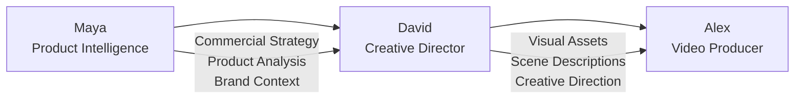

# Technical Design: Creative Director Agent (David)

## Architecture Overview

David follows the sophisticated multi-agent architecture established by Maya, implementing the same demo/real mode pattern, Zustand state management, and conversational AI system while specializing in visual creativity and asset generation.

## System Architecture

### Agent Pipeline Position


### Core Components Architecture
```mermaid
graph TB
    subgraph "Frontend - React Components"
        UI[CreativeDirectorCard.tsx]
        Chat[ChatContainer.tsx - Reused]
        Avatar[AgentAvatar - David State]
    end
    
    subgraph "State Management - Zustand"
        Store[creative-director-store.ts]
    end
    
    subgraph "Backend API Routes"
        Main[/api/agents/creative-director/route.ts]
        ChatAPI[/api/agents/creative-director/chat/route.ts]
        Assets[/api/agents/creative-director/assets/route.ts]
        Handoff[/api/agents/creative-director/handoff/route.ts]
    end
    
    subgraph "David's Agent System"
        Core[lib/agents/creative-director/core/]
        Tools[lib/agents/creative-director/tools/]
        Types[lib/agents/creative-director/types/]
        Persona[lib/constants/david-persona.ts]
    end
    
    subgraph "External Services"
        Imagen[Imagen API]
        Storage[Cloud Storage]
        Firestore[Firestore]
    end
    
    UI --> Store
    UI --> Main
    Chat --> ChatAPI
    Main --> Core
    ChatAPI --> Core
    Assets --> Tools
    Core --> Persona
    Tools --> Imagen
    Tools --> Storage
    Core --> Firestore
```

## Data Models

### David's State Management (Zustand Store)

```typescript
interface CreativeDirectorStore {
  // Session & Handoff State
  sessionId: string;
  mayaHandoffData: MayaHandoffData | null;
  
  // David's Conversation State
  messages: ChatMessage[];
  isAgentTyping: boolean;
  chatInputMessage: string;
  
  // Visual Decision State
  visualStyle: VisualStyleDecisions;
  sceneCompositions: SceneComposition[];
  colorPalette: ColorPalette;
  
  // Asset Generation State
  generatedAssets: GeneratedAsset[];
  assetGenerationInProgress: boolean;
  
  // UI State
  showCreativeChat: boolean;
  expandedSections: Record<string, boolean>;
  
  // Actions
  setMayaHandoffData: (data: MayaHandoffData) => void;
  addMessage: (message: ChatMessage) => void;
  setChatInputMessage: (message: string) => void;
  updateVisualStyle: (updates: Partial<VisualStyleDecisions>) => void;
  addGeneratedAsset: (asset: GeneratedAsset) => void;
  setShowCreativeChat: (show: boolean) => void;
  toggleSection: (section: string) => void;
  
  // Complex Actions
  processVisualDecision: (decision: VisualDecision) => Promise<void>;
  generateAsset: (assetType: AssetType, specifications: AssetSpecs) => Promise<void>;
  prepareAlexHandoff: () => AlexHandoffData;
}
```

### Maya Handoff Data Structure

```typescript
interface MayaHandoffData {
  // Maya's Complete Analysis
  productAnalysis: ProductAnalysis;
  commercialStrategy: CommercialStrategy;
  conversationHistory: ChatMessage[];
  
  // Strategy State
  finalizedStrategy: boolean;
  keyInsights: string[];
  strategicPriorities: string[];
  
  // Context for David
  visualOpportunities: string[];
  brandPersonality: BrandPersonality;
  targetAudienceVisualPrefs: VisualPreferences;
  
  // Session Metadata
  sessionId: string;
  handoffTimestamp: number;
  locale: 'en' | 'ja';
  totalCost: number;
}
```

### David's Visual Decision System

```typescript
interface VisualStyleDecisions {
  overallStyle: VisualStyleType;
  colorPalette: {
    primary: ColorSpec;
    secondary: ColorSpec;
    accent: ColorSpec;
    background: ColorSpec;
  };
  typography: TypographySpec;
  visualTreatment: VisualTreatmentSpec;
  sceneAesthetics: SceneAestheticsSpec;
}

interface GeneratedAsset {
  id: string;
  type: AssetType;
  title: string;
  description: string;
  imageUrl?: string; // Real mode: actual URL, Demo mode: placeholder
  imagenPrompt: string;
  specifications: AssetSpecs;
  generatedAt: number;
  cost: number; // Real cost in real mode, mock cost in demo
  status: 'generating' | 'completed' | 'failed';
}

type AssetType = 
  | 'background'
  | 'product-hero'
  | 'lifestyle-scene'
  | 'texture-overlay'
  | 'mood-board'
  | 'style-frame'
  | 'color-palette-visual';
```

### Alex Handoff Data Structure

```typescript
interface AlexHandoffData {
  // From Maya (passed through)
  productAnalysis: ProductAnalysis;
  commercialStrategy: CommercialStrategy;
  
  // David's Creative Direction
  visualStyle: VisualStyleDecisions;
  generatedAssets: GeneratedAsset[];
  sceneCompositions: DetailedSceneComposition[];
  colorPalette: ColorPalette;
  creativeNotes: string[];
  
  // Technical Specifications for Video
  recommendedVideoSpecs: {
    aspectRatio: '16:9' | '1:1' | '9:16';
    duration: '15s' | '30s' | '60s';
    style: 'cinematic' | 'commercial' | 'social';
    pacing: 'fast' | 'medium' | 'slow';
  };
  
  // Asset Organization for Alex
  assetsByScene: Record<string, GeneratedAsset[]>;
  transitionRecommendations: TransitionSpec[];
  
  // Session Context
  sessionId: string;
  handoffTimestamp: number;
  locale: 'en' | 'ja';
  totalCostSoFar: number;
}
```

## API Endpoints Design

### Main Agent Orchestration
```typescript
// app/api/agents/creative-director/route.ts
export async function POST(request: NextRequest) {
  const body = await request.json();
  const { action, sessionId } = body;
  
  switch (action) {
    case 'initialize':
      return await initializeDavidFromMaya(body);
    case 'get-status':
      return await getDavidStatus(sessionId);
    case 'prepare-handoff':
      return await prepareAlexHandoff(sessionId);
    default:
      return NextResponse.json({ error: 'Invalid action' }, { status: 400 });
  }
}
```

### Chat Conversation System
```typescript
// app/api/agents/creative-director/chat/route.ts
export async function POST(request: NextRequest) {
  const body = await request.json();
  const { sessionId, message, locale } = body;
  
  // Demo/Real mode detection (following Maya's pattern)
  const isDemoMode = AppModeConfig.getMode() === 'demo';
  
  if (isDemoMode) {
    return await processDavidDemoChat(body);
  }
  
  return await processDavidRealChat(body);
}

async function processDavidDemoChat(request: DavidChatRequest): Promise<DavidChatResponse> {
  // Sophisticated mock conversation with David's personality
  // Realistic delay: 1-3 seconds
  // David's creative expertise and visual terminology
  // Build on visual decisions and maintain creative continuity
}

async function processDavidRealChat(request: DavidChatRequest): Promise<DavidChatResponse> {
  // Real Gemini Pro conversation with David's persona
  // Same response structure as demo mode
  // Actual creative analysis and recommendations
}
```

### Asset Generation System
```typescript
// app/api/agents/creative-director/assets/route.ts
export async function POST(request: NextRequest) {
  const body = await request.json();
  const { sessionId, assetType, specifications } = body;
  
  const isDemoMode = AppModeConfig.getMode() === 'demo';
  
  if (isDemoMode) {
    return await generateDemoAsset(body);
  }
  
  return await generateRealAsset(body);
}

async function generateRealAsset(request: AssetGenerationRequest): Promise<AssetGenerationResponse> {
  // 1. Build Imagen prompt from David's creative specifications
  // 2. Call Imagen API with detailed artistic direction
  // 3. Store asset in Cloud Storage
  // 4. Update session state with generated asset
  // 5. Track cost and usage
}
```

## Component Architecture

### CreativeDirectorCard Component
```typescript
// components/home/CreativeDirectorCard.tsx
interface CreativeDirectorCardProps {
  dict: Dictionary;
  locale: Locale;
  onProceedToVideoProducer: () => void;
}

export default function CreativeDirectorCard({
  dict,
  locale,
  onProceedToVideoProducer,
}: CreativeDirectorCardProps) {
  const {
    sessionId,
    messages,
    isConnected,
    isAgentTyping,
    showCreativeChat,
    chatInputMessage,
    visualStyle,
    generatedAssets,
    expandedSections,
    // Actions
    setShowCreativeChat,
    setChatInputMessage,
    addMessage,
    toggleSection,
    generateAsset,
    processVisualDecision,
  } = useCreativeDirectorStore();

  // Toggle between Visual Assets Review and Chat with David
  // Similar to Maya's strategy/chat toggle but focused on creative assets
  // David's personality-driven chat system
  // Visual asset gallery with generation capabilities
}
```

### Reuse ChatContainer with David's Personality
```typescript
// David reuses the same ChatContainer.tsx but with:
// - David's persona and conversation style
// - Visual-focused quick actions
// - Asset generation capabilities
// - Creative decision confirmation system

<ChatContainer
  sessionId={sessionId}
  messages={messages}
  isConnected={isConnected}
  isAgentTyping={isAgentTyping}
  onSendMessage={handleSendMessage}
  onAssetGenerationRequest={handleAssetGeneration}
  dict={dict}
  locale={locale}
  agentPersona="david"
  specialActions={{
    generateAsset: handleAssetGeneration,
    updateVisualStyle: handleVisualStyleUpdate,
  }}
/>
```

## David's Agent System Implementation

### Core Agent Structure
```typescript
// lib/agents/creative-director/core/chat.ts
export async function processDavidMessage(request: DavidChatRequest): Promise<DavidChatResponse> {
  const startTime = Date.now();
  
  // Demo/Real mode routing (following Maya's pattern exactly)
  const shouldUseMockMode = AppModeConfig.getMode() === 'demo';
  
  if (shouldUseMockMode) {
    console.log("[DAVID CHAT] Using demo mode for creative conversation");
    return await generateDavidMockResponse(request, startTime);
  }
  
  console.log("[DAVID CHAT] Using real Vertex AI for creative direction");
  
  // Build David's creative conversation prompt
  const creativePrompt = generateDavidConversationPrompt(request);
  
  // Call Gemini Pro with David's persona and creative context
  const geminiResponse = await callGeminiWithDavidPersona(creativePrompt);
  
  // Analyze for visual decisions and asset generation opportunities
  const creativResponseAnalysis = await analyzeCreativeResponse(geminiResponse, request);
  
  return {
    messageId: `david-${Date.now()}-${Math.random().toString(36).substr(2, 9)}`,
    response: creativResponseAnalysis.cleanedResponse,
    processingTime: Date.now() - startTime,
    cost: creativResponseAnalysis.cost,
    confidence: creativResponseAnalysis.confidence,
    nextAction: creativResponseAnalysis.nextAction,
    suggestedFollowUps: creativResponseAnalysis.suggestedFollowUps,
    creativeInsights: creativResponseAnalysis.creativeInsights,
    assetRecommendations: creativResponseAnalysis.assetRecommendations,
  };
}
```

### David's Mock Response System (Demo Mode)
```typescript
// lib/agents/creative-director/core/demo-handler.ts
async function generateDavidMockResponse(
  request: DavidChatRequest,
  startTime: number
): Promise<DavidChatResponse> {
  // Simulate David's creative thinking delay
  await new Promise(resolve => setTimeout(resolve, 1000 + Math.random() * 2000));
  
  const locale = request.locale;
  const { DAVID_PERSONA } = await import('@/lib/constants/david-persona');
  
  // Check if this is David's first greeting after Maya handoff
  const chatMessages = request.context.conversationHistory?.filter(
    msg => msg.type === 'user' || (msg.type === 'agent' && msg.agentName === 'David')
  ) || [];
  
  if (request.context.mayaHandoffData && chatMessages.length === 0) {
    // David's initial greeting acknowledging Maya's work
    const davidGreeting = locale === 'ja' 
      ? `こんにちは！私はDavid、クリエイティブディレクターです。Mayaの素晴らしい戦略分析を見させていただきました - ${request.context.mayaHandoffData.productAnalysis.product.name}の商用戦略が本当に印象的ですね！\n\n今度は、この戦略を視覚的に魅力的なアセットに変換していきましょう。どんなビジュアルスタイルがあなたのブランドにぴったりだと思いますか？`
      : `${DAVID_PERSONA.voiceExamples.opening}\n\nI've reviewed Maya's brilliant strategy work for ${request.context.mayaHandoffData.productAnalysis.product.name} - she's set us up for visual success! What style direction resonates with your brand vision?`;
    
    // Generate visual-focused quick actions
    const visualQuickActions = generateDavidQuickActions(
      request.context.mayaHandoffData.productAnalysis,
      locale
    );
    
    return {
      messageId: `david-greeting-${Date.now()}-${Math.random().toString(36).substr(2, 9)}`,
      response: davidGreeting,
      processingTime: Date.now() - startTime,
      cost: 0.01,
      confidence: 0.95,
      nextAction: 'continue',
      suggestedFollowUps: visualQuickActions,
      creativeInsights: [
        locale === 'ja' ? 'ブランドアイデンティティの視覚化' : 'Brand identity visualization opportunities',
        locale === 'ja' ? '製品の視覚的魅力の最適化' : 'Product visual appeal optimization'
      ],
      assetRecommendations: ['mood-board', 'color-palette-visual', 'style-frame'],
    };
  }
  
  // Regular David mock responses with creative expertise
  const responses = getDavidMockResponses(locale, request.context);
  const randomResponse = responses[Math.floor(Math.random() * responses.length)];
  
  return {
    messageId: `david-mock-${Date.now()}-${Math.random().toString(36).substr(2, 9)}`,
    response: randomResponse,
    processingTime: Date.now() - startTime,
    cost: 0.01,
    confidence: 0.85,
    nextAction: 'continue',
    suggestedFollowUps: generateDavidFollowUps(locale, request.context),
    creativeInsights: generateMockCreativeInsights(locale),
    assetRecommendations: generateMockAssetRecommendations(),
  };
}
```

### Asset Generation System
```typescript
// lib/agents/creative-director/tools/imagen-integration.ts
export async function generateAssetWithImagen(
  specifications: AssetSpecs,
  davidContext: DavidCreativeContext
): Promise<GeneratedAsset> {
  
  // Build sophisticated Imagen prompt with David's creative direction
  const imagenPrompt = buildDavidImagenPrompt(specifications, davidContext);
  
  // Call Imagen API with professional creative parameters
  const imagenResponse = await ImagenService.generateImage({
    prompt: imagenPrompt.text,
    aspectRatio: specifications.aspectRatio,
    style: specifications.style,
    quality: 'premium',
    safetyFilters: ['moderate'],
  });
  
  // Store in Cloud Storage with proper naming
  const assetUrl = await CloudStorageService.storeAsset(
    imagenResponse.imageData,
    `david-assets/${davidContext.sessionId}/${specifications.type}-${Date.now()}.png`
  );
  
  return {
    id: crypto.randomUUID(),
    type: specifications.type,
    title: specifications.title,
    description: imagenPrompt.description,
    imageUrl: assetUrl,
    imagenPrompt: imagenPrompt.text,
    specifications,
    generatedAt: Date.now(),
    cost: imagenResponse.cost,
    status: 'completed',
  };
}
```

## Integration Patterns

### Maya → David Handoff
```typescript
// Seamless transition preserving all context
export async function initializeDavidFromMaya(mayaHandoffData: MayaHandoffData): Promise<void> {
  const davidStore = useCreativeDirectorStore.getState();
  
  // Set Maya's context for David's reference
  davidStore.setMayaHandoffData(mayaHandoffData);
  
  // Initialize David's creative analysis based on Maya's strategy
  const initialVisualAnalysis = analyzeVisualOpportunities(mayaHandoffData);
  davidStore.updateVisualStyle(initialVisualAnalysis);
  
  // Prepare David's greeting referencing Maya's work
  const davidGreeting = await generateHandoffGreeting(mayaHandoffData);
  davidStore.addMessage(davidGreeting);
  
  // Log successful handoff
  console.log(`[DAVID HANDOFF] Initialized with Maya's context for ${mayaHandoffData.sessionId}`);
}
```

### David → Alex Handoff
```typescript
// Comprehensive creative direction package for Alex
export function prepareDavidToAlexHandoff(): AlexHandoffData {
  const davidStore = useCreativeDirectorStore.getState();
  
  return {
    // Pass through Maya's analysis
    productAnalysis: davidStore.mayaHandoffData.productAnalysis,
    commercialStrategy: davidStore.mayaHandoffData.commercialStrategy,
    
    // David's creative contributions
    visualStyle: davidStore.visualStyle,
    generatedAssets: davidStore.generatedAssets,
    sceneCompositions: davidStore.sceneCompositions,
    colorPalette: davidStore.colorPalette,
    creativeNotes: extractDavidCreativeNotes(davidStore.messages),
    
    // Technical specifications for Alex
    recommendedVideoSpecs: generateVideoSpecsFromVisualDecisions(davidStore.visualStyle),
    assetsByScene: organizeAssetsByScene(davidStore.generatedAssets, davidStore.sceneCompositions),
    transitionRecommendations: generateTransitionRecommendations(davidStore.visualStyle),
    
    // Context
    sessionId: davidStore.sessionId,
    handoffTimestamp: Date.now(),
    locale: davidStore.locale,
    totalCostSoFar: calculateTotalCost(davidStore.generatedAssets),
  };
}
```

## Performance Optimization

### Asset Generation Optimization
- **Parallel Processing**: Generate multiple assets concurrently where appropriate
- **Caching Strategy**: Cache commonly requested asset types and styles
- **Progressive Loading**: Show asset generation progress with David's creative commentary
- **Cost Management**: Track costs per asset and warn before limits

### State Management Optimization
- **Selective Updates**: Update only changed parts of visual decisions
- **Memory Management**: Clean up old asset data after handoff
- **Persistence Strategy**: Save critical creative decisions to Firestore
- **Efficient Rerenders**: Minimize Zustand subscription scope

## Security & Privacy

### Asset Security
- **Signed URLs**: All generated assets use temporary signed URLs
- **Content Filtering**: Imagen API safety filters enabled
- **User Content**: No personal data in asset generation prompts
- **Cleanup Policy**: Automatic asset deletion after 24 hours

### API Security
- **Server-side Authentication**: All GCP calls from backend only
- **Rate Limiting**: Prevent asset generation abuse
- **Input Validation**: Sanitize all creative specifications
- **Session Validation**: Verify session ownership for all operations

---

**Status**: Draft - Ready for Review  
**Next Phase**: Task Generation  
**Key Dependencies**: Maya's handoff system, Imagen API integration, David persona implementation